Notas sobre la descripción funcional.

# Capítulo 3 Anaerobic Treatment

## Modos

Hay 3 modos de operación:
- Mixing mode
- Recirculation mode
- Normal operation mode

### Interface y secuencia

Habrá un botón "start" para iniciar la secuencia y selector o selectores para cambiar de fase

En caso de alarma crítica ("CA", ver tabla FCD) el equipo vuelve al estado inicial (antes de "mixing") desactivándose secuencialmente la selección de "Modo normal", "Modo recirculación" y "Mixing" <!--Esto hay que verlo con Simon, creo que no es así -->.

En caso de pulsador de emergencia (ESD) todos los equipos se desactivan y las válvulas pasan a su posición de seguridad.

#### Interface

Habrá un selector para que el operador avance desde el "Reposo" al "Mixing Mode", "Recirculation Mode" y "Modo Normal". Si se dan condiciones de desactivación, el selector cambia de posición.

#### Mixing Mode

##### <u>Condiciones arranque</u>

- Reactor anaerobio BR7-AG-0912x disponible
- Niveles (BR7-LT-0018x y BR7-LT-0019x) disponibles y por encima del LL
- Se ha activado el selector

##### <u>Activaciones</u>

- El agitador BR7-AG-0912x se pone en marcha.

##### <u>Secuencias permitidas en este modo</u>

Una vez activada se permiten las rutinas WAnS y Filtración en la UF.

##### <u>Condiciones de paro</u>

- Reactor anaerobio BR7-AG-0912x no disponible
- Niveles (BR7-LT-0018x y BR7-LT-0019x) por debajo del LL o no disponibles.
- Se ha desactivado el "Mixing Mode" desde el selector.

Cuando se desactiva el "Mixing Mode", se para el agitador BR7-AG-0912x, se detiene la rutina WAnS y la rutina de filtración.

#### Recirculation Mode

##### <u>Interface</u>

Habrá un selector para indicar si el bypass del chopper (BR7-Z-0041x) está hecho y permite el arranque del modo.

##### <u>Condiciones arranque</u>

- "Mixing mode activo" y agitador BR7-AG-0912x en marcha.
- "Defoaming Loop Pumping" disponible:
  - Bomba de "Defoaming Loop" (BR7-P-0220x) disponible.
  - Chopper (BR7-Z-0041x) disponible o en bypass.
  - Transmisor de presión (BR7-PT-0031x) disponible y sin alarma.

- Transmisor de caudal BR7-FT-0010x disponible y sin alarma LL.
- Transmisor de presión BR7-PT-0190x disponible. <!-- Preguntar a Simon si sin alarma también -->
- Transmisor de temperatura BR7-TT-0011x disponible. <!-- Preguntar a Simon si sin alarma también -->
- Transmisor de pH BR7-AT-0015x disponible.
- Condiciones que parecen lógicas aunque no estén en la FCD Rev 7
  - Se tiene alguno de los strainers disponible (BR7-F-0205/6x) <!-- A ver lo que nos da Worley-->
  - Transmisor de presión BR7-PT-0179x disponible y sin alarma.
  - Transmisor de temperatura BR7-TT-0014x disponible y sin alarma (aunque esto quizás no sea tan necesario)

- Se ha activado el selector para el "Recirculation Mode"

##### <u>Activaciones</u>

Se tiene la siguiente secuencia:

```mermaid
stateDiagram-v2

    state "Marcha Chopper BR7-Z-0041x" as S1
    state "Marcha Bombeo BR7-P-0202x" as S2
    state "Activar regulaciones" as S3
    [*] --> S1 
        
    S1 --> S2: Temporizador (15 seg configurable)
    note right of S1
        Arranca el STRAINER
        Si el chopper está en fallo, se puede bypasear
    end note
        
    S2 --> S3: Temporizador (10 seg configurable)
    note right of S3
        Inicio regulación de pH (lazo de control)
        Inicio regulación de temperatura (si aplica, lazo de control)
        Inicio dosificación antiespumante (si se debe poner en marcha, lazo de control)
    end note
    
%%    S3 --> [*]
    
```
Durante esta fase se permiten las rutinas WAnS y Filtración en la UF.

##### <u>Secuencias permitidas en este modo</u>

- Todas las que permite el Mixing mode.
- Regulación de temperatura mediante el intercambiador BR7-E-0206x.
- Regulación de pH.
- Dosificación de antiespumante.

##### <u>Condiciones de paro</u>

- Alguna de las condiciones de paro del Mixing Mode
- Niveles (BR7-LT-0018x y BR7-LT-0019x) por debajo del LL
- No se tiene el "Defoaming Loop Pumping" disponible si cualquiera de estas condiciones se cumple:
  - Bomba de "Defoaming Loop" (BR7-P-0202x) no disponible.
  - Chopper (BR7-Z-0041x) no disponible y no se ha hecho el bypass.
  - Transmisor de presión (BR7-PT-0031x) no disponible y o alarma HH.
- Transmisor de caudal BR7-FT-0010x no disponible y o alarma HH/LL.
- Transmisor de presión BR7-PT-0190x no disponible o alarma HH.
- No se tiene ninguno de los strainers disponible (BR7-F-0205/6x)
- Fallo en la válvula de bypass de Strainer BR7-UV-0043/44.
- Se ha desactivado el selector para el "Recirculation Mode" manualmente.

Cuando se desactiva el "Recirculation Mode", se para el bombeo (BR7-P-0220x y BR7-Z-0041x) y se detiene las regulaciones de pH, temperatura y dosificación de antiespumante.

#### Modo "Normal"

##### <u>Condiciones arranque</u>

- "Recirculation Mode" activo, agitador BR7-AG-0912x y bombeo (BR7-P-0220x) en marcha.
- Niveles del BR7-T-202 (BR7-LT-0100 y BR7-LT-0101) disponibles.
- Bomba de alimentación (BR7-P-0110x) desde el BR7-T-202 disponible.
- Transmisor de caudal BR7-FT-0005x disponible y sin alarma.
- Transmisor de temperatura a la salida de intercambiador de agua fría (BR7-TT-0010x) disponible y sin alarma.
- Transmisor de temperatura del defoaming loop (BR7-TT-0011x) disponible y sin alarma.
- Válvula reguladora de agua fría (BR7-TV-0001x) disponible.
- Transmisor de presión del reactor biológico disponible y sin alarma (BR7-PT-0026x)
- Antorcha disponible (diría que la línea de gas entera). 
- Otros que no vienen pero sí tiene sentido que estén en el arranque:
  - Transmisores de presión a la entrada y salida del intercamiador de agua fría (BR7-PT-0023x/24x).
  - Válvulas de entrada al intercambiador (BR7-UV-0034/37) y bypass del intercambiador (BR7-UV-0035/38).
  - No existe nivel alto de espumas en el reactor (BR7-LS-0010x).
  - No hay nivel bajo en los niveles del BR7-T-202 (BR7-LT-0100 y BR7-LT-0101).
  - No hay alarma de nivel alto de BR7-LS-0009x
  - No hay nivel alto en los niveles del reactor (BR7-LT-18x/19x)

- Se ha activado el selector para el "Modo Normal"

##### <u>Activaciones</u>

```mermaid
stateDiagram-v2

    state "Abrir válvulas BR7-UV-34/37" as S1
    state "Marcha Bomba alimentación BR7-P-0110x" as S2
    state "Activar regulación de temperatura" as S3
    [*] --> S1 
        
    S1 --> S2: FCA BR7-UV-34/37 <br/> +  Temporizador (15 seg configurable)
    note right of S1
        Si BR7-UV-0035/38 son FCO cerrar
    end note
        
    S2 --> S3: Temporizador (10 seg configurable)
    note right of S3
        Inicio regulación de temperatura (lazo de control)
    end note
    
%%    S3 --> [*]
    
```
##### <u>Secuencias permitidas en este modo</u>

- Todas las que permite el Recirculation mode.
- Regulación de temperatura mediante el intercambiador BR7-E-0201x.
- Regulación de caudal de entrada al reactor.

##### <u>Condiciones de paro</u>

- Cualquiera de las condiciones de paro del "Modo Recirculación".
- Niveles del BR7-T-202 (BR7-LT-0100 y BR7-LT-0101) no disponibles o alguno de los dos tiene nivel bajo (LL).
- Bomba de alimentación BR7-P-0110x no disponible.
- Transmisor de caudal BR7-FT-0005x no disponible.
- Alarma de caudal bajo BR7-FT-0005x_LL. <!-- Alarma de caudal bajo BR7-FT-0005x_HH / Presión en PT16 o PT23 LL. Comentar con Simón que esto puede ser síntoma de tubería rota o de que la bomba no está trabajando bien por lo que sea. ¿No desactiva el modo normal y para la bomba o se deja actuar al operador?-->
- Antorcha no disponible. <!--Preguntar a Simon si aparte de la antorcha no disponible qué otros elementos en la línea de gas pueden hacer parar el modo normal-->
- Alarma de exceso de tiempo en funcionamiento con bypass en el intercambiador de entrada.
- Alarma H en el transmisor de presión del reactor biológico (BR7-PT-0026x) o no disponible. <!-- Preguntar a Simon por qué el no disponible no da alarma--> 
- Alarma de muy alta temperatura (HH) en BR7-TT-0010x, a la entrada del reactor (salida del intercambiador de entrada BR7-E-0201x).
- Alarma de nivel alto en el detector de espuma BR7-LS-0011x. <!-- Preguntar a Simon por qué en los LS 9, 10 y 11 en el FCT aparece el "0" como OK y el "1" como fallo, cuando normalmente es al revés para detectar la desconexión -->
- Alarma de nivel alto de BR7-LS-0009x.
- Alarma de nivel alto en los niveles del reactor (BR7-LT-18x/19x).
- Alarma de muy alta / muy baja temperatura (HH/LL) en el BR7-TT-0011x (a la entrada del intercambiador de defoaming BR7-E-0206x). <!-- Preguntar a Simon si este TT tiene rotura de hilo, si sigue en modo normal-->
- Alarma de muy baja temperatura (LL) en el BR7-TT-0014x (a la salida del intercambiador de defoaming BR7-E-0206x).
- Alarma HH/LL del pH en el lazo de defoaming BR7-AT-0015x o no disponibilidad de la señal.
- Alarma LL en el nivel de seguridad BR7-LT-0027 del pozo de condensados o no se tienen disponibles los niveles BR7-LT-0027/28 <!-- Ver con Simon esto, no le veo mucho sentido, salvo que en el FCT lo de "Normal Mode" no se refiera aquí al funcionamiento del reactor sino al bombeo -->
- Se ha desactivado el selector del "Modo Normal".
- <!--Preguntar a Simon si se tienen que detener la filtración (UF) se tiene que detener el modo normal-->

## APS

El APS es una secuencia que consta de las siguientes subrutinas:
- **Inactivo** (Idle). 
- **Filtración**, para la producción de permeado, es de inicio automático (aunque se pondrá un botón para iniciarla cumpliendo algunas condiciones) e incluye las subrutinas de **Producción** y **Relación**.
- **Espera**, en automático cuando para la **filtración** y retrasa el enjuague (**Flush**). Incluye las subrutinas **Espera** y **Skid-Refresh**.
- **Flush** que puede iniciarse de manera manual o automática cuando finaliza la **Espera**. 
- **Venteo** Es una operación prácticamente manual.
- **CIP** Operación semiautomática de inicio manual por el operador.

```mermaid
graph TD
    E0((idle)) -->|Solicitud producción| E1((Filtración))
    E1 -->|Fin Solicitud producción| E2((Espera))
    E1((Filtración)) -->|Tiempo máx filtración| E3((Flushing))
    E1((Filtración)) -->|Manual + Fallo CA <br/> o PT-0026x-HH| E3((Flushing))
    E0 -->|Manual| E3
    E2 -->|Timpo máximo en espera o manual| E3
    E2 -->|Solicitud producción| E1
    E1 -.->|Tiempo filtración| A[Relajación]
    E2 -.->|Tiempo espera| B[Refresco]
    A -.-> |Tiempo relajación| E1
    B -.-> |Tiempo refresco| E2
```

### Filtración

#### Condiciones iniciales

- **Solicitud de producción**, que podrá ser **automática** (según niveles BR7-LT-0018X & BR7-LT-0019X ) o Pulsador manual de nicio de producción.
- La solicitud de producción automática se activa si el nivel BR7-LT-0018X > H y se desactiva cuando dicho nivel es < L (histéresis).

#### Condiciones de marcha

- Está en modo "Mixing", "Recirculation" o "Normal mode". 
- Hay "solicitud de producción"
- Tiene disponible el chopper BR7-Z-0035x y la bomba de alimentación a la UF (BR7-P-0210x).

#### Condiciones de paro
- No hay solicitud de producción --> Pasa de producción a espera
- Finaliza el tiempo total de producción --> Pasa a secuencia de Flushing 
- Paro por alarma crítica (CA)
  - Se levanta el flag de "Fango en unidad UF"
  - Se queda en fase de filtración con todo parado (APS) hasta que se haga un flushing manual y se quede en estado "**Inactivo**".

#### Secuencia de producción

```mermaid
stateDiagram-v2
    FILTRATION --> RELAXATION: Fin temporizador FILTRATION (120 min configurable)
    
    FILTRATION --> FLUSH: Tiempo máximo en rutina FILTRATION
    
    RELAXATION --> FILTRATION: Fin fase RELAXATION
    note right of RELAXATION
        Cierran las válvulas de pemeado
    end note
    
   FILTRATION --> WAIT: NO Demanda de produccción
```

##### <u>Temporizadores</u> 
- Tiempo total de filtración
- Tiempo de filtración
- Tiempo de relajación

##### <u>Variables de operador</u> 

- Posición inicial de las válvulas de control de caudal (BR7-FV-0013x a BR7-FV-0018x).
- Tipo de relajación (Secuencial / Simultánea)

##### <u>Rutina de filtración y válvulas</u>

```mermaid
stateDiagram-v2

    state "**1** <br/> Inicio" as S1
    state "**2** <br/> Abrir válvulas permeado <br/> BR7-UV-0052/0059 " as S2
    state "**3** <br/> Abrir válvulas de control al 50% <br/> BR7-FV-0018X, BR7-FV-0017X, <br/>BR7-FV-0016X, BR7-FV-0015X, <br/>BR7-FV-0014X, BR7-FV-0013X" as S3
    state "**4** <br/> Abrir válvulas de alimentación a la UF BR7-UV-0051/0058" as S4
    state "**5** <br/> Abrir válvulas de rechazo de la UF  BR7-UV-0047/0054" as S5
    state "**6** <br/> Marcha de la bomba BR7-P-0210X" as S6
    state "**7** <br/> Activación de la regulación <br/> de las válvulas <br/> de permeado (FV)" as S7
    state "**8** <br/> Se inicia (o reinicia)<br/>el tiempo de filtración" as S8
    state "**9** <br/> Se inicia relajación" as S9
    state "**10** <br/> Fin producción" as S10
    
    [*] --> S1 
        
    S1 --> S2
    note right of S1
        Se inicia el tiempo <br/> **TOTAL** de filtración <br/>(o se reinicia si estaba en marcha)
    end note
        
    S2 --> S3: Orden de apertura válvulas
    note right of S3
        Posición a determinar en SCADA
    end note

    S3 --> S4: Orden de apertura válvulas

    S4 --> S5: Orden de apertura válvulas
    
    S5 --> S6: Orden de apertura válvulas

    S6 --> S7: Orden de marcha bombas
    note right of S7
        Inicio regulación por PID
    end note
    
    S7 --> S8
    
    S8 --> S9: Fin tiempo filtración
    note right of S9
        Relajación "secuencial"<br/>o "simultánea"
        Tiempo a determinar por operador
    end note
    
    S9 --> S7: Fin tiempo de relajación (30 seg)
    
    S8 --> S10: Fin tiempo de filtración **TOTAL**
    
    
%%    S3 --> [*]
    
```

|  | TAG | 1 | 2 | 3 | 4 | 5 | 6 | 7 | 8 | 9 | 10 |
| :---- | :---: | :---: | :---: | :---: | :---: | :---: | :---: | :---: | :---: | :---: | :---: |
| **VALVES** |  |  |  |  |  |  |  |  |  |  |  |
| UF feed valve | BR7-UV-0051/0058 | C | C | C | O | O | O | O | O | O | **BACK TO STEP 7** |
| UF concentrate return valve | BR7-UV-0047/0054 | C | C | C | C | O | O | O | O | O |  |
| UF permeate valve | BR7-UV-0052/0059 | C | O | O | O | O | O | O | O | O |  |
| UF permeate control valve stage 1..6 | BR7-FV-0018..13X | C | C | F | F | F | F | R | R | F |  |
| **EQUIPMENT** |  |  |  |  |  |  |  |  |  |  |  |
| UF circulation pump | BR7-P-0210X | P | P | P | P | P | M | M | M | M |  |
| **SETPOINTS** |  |  |  |  |  |  |  |  |  |  |  |
| circulation flow rate setpoint | circulation\_flow\_SP |  |  |  |  |  | X | X | X | X |  |

- Válvulas todo/nada:
  - C: Cerrado
  - O: Abierta

- Motores:
  - P: Paro
  - M: Marcha

- Equipos con regulación (válvulas y motores):
  - F: Regulación fija
  - R: Regulación activa

- Setpoint:
  - X: Regulación con setpoint activado

#### Secuencia de espera (WAIT)

```mermaid
stateDiagram-v2
    WAIT --> REFRESH: Fin temporizador WAIT (120 min configurable)
    
    WAIT --> FLUSH: Tiempo máximo en rutina WAIT
    
    REFRESH --> FIN_REFRESH: Fin temporizador REFRESH
    note right of REFRESH
        Abren válvulas del Skid en modo REFRESH
        Arranca la bomba de UF a baja velocidad 
    end note
    
    FIN_REFRESH --> WAIT: No ha llegado al final de etapas de refresco
    note right of FIN_REFRESH
        Incrementa la cuenta de refresco
        Detiene bomba UF
        Cierra válvulas UF
    end note
    
    FIN_REFRESH --> FLUSH: Número máximo de etapas de refresco
    
    WAIT --> PRODUCCIÓN: Demanda de produccción
```

### CIP

Se calcula que cada módulo tiene unos 200 litros, como tiene 12 (6x2) son 2400 más los accesorios, etc., unos 3000 l (3 m3).

Es requisito para hacer el CIP que la secuencia del flushing se haya hecho. Hay que usar 6 m3 de agua del tanque de Flushing para limpiar el skid (el doble que el volumen del skid). Haciendo números a 206 m3/h para un volumen de 6 m3, serían unos 105 seg, que redondeando quedan 2 min.

La secuencia de la limpieza CIP es la siguiente:

```mermaid
flowchart TD
    E0[Etapa 0 <br/>Preparar el tanque y hacer flushing con agua del skid] -->|Tiempo flushing <br/> y tanque CIP preparado| E1[Etapa 1  <br/> Primer lavado con CIP líquido y primer remojo *first soak*]
    E1-->|Tiempo lavado CIP | E11[Etapa 1.1 <br/> Remojo tras primer lavado.]
    E11-->|Tiempo remojo | E2[Etapa 2 <br/> Desplazar los químicos del primer lavado y <br/> renovar los químicos]
    E2-->|Tiempo lavado CIP |E21[Etapa 2.1: Recirculación en CIP]
    E21-->|Tiempo recirculación CIP |E22[Etapa 2.2: Remojo tras 2º lavado]
    E22 -->|Fin tiempo 2º remojo| E3[Etapa 3: Recirculación de los químicos.]
    E3 --> |Fin tiempo de recirculación| E31[Etapa 3.1 Espera remojo]
    E31 --> |Espera tiempo remojo| E3
    E31 -->|Fin número de lavados y remojos| E4[Etapa 4: Vaciar los químicos del tanque CIP  <br/> al tanque de alimentación]
    E4 --> |CIP vacío hasta LL| E5[Etapa 5: Drenaje del líquido CIP]
    E5 --> E6[Etapa 6: Flushing *enjuague* con agua de permeado]
```

#### Descripción de las etapas

**Etapa 0**. Secuencia de Flushing y preparación de la solución CIP. Es requisito para hacer el CIP que la secuencia del flushing se haya hecho. Hay que usar 6 m3 de agua del tanque de Flushing para limpiar el skid (el doble que el volumen del skid). Haciendo números a 206 m3/h para un volumen de 6 m3, serían unos 105 seg, que redondeando quedan 2 min. 

Al final de esta etapa en el skid quedan 3 m3 de agua limpia y al reactor le han llegado otros 3 m3. En el tanque de CIP se tienen 9 m3 de solción química preparada.

```mermaid
flowchart LR
    A["UF Permeate <br/> tank"] -->|"210 m3/h<br/>6 m3 of permeate"| B["UF skid"]
    B -->|"210 m3/h<br/>3 m3 of biomass<br/>3 m3 of permeate"| C["Anaerobic Reactor"]
  	
    D["agua"] -->|"10 m3/h<br/>9 m3 of service water"| E["CIP tank"]
    F["Feed tank A/B"]
   NoteEnd["📊 Estado final de etapa<br/>Total volume received:<br/>3 m3 of biomass<br/>3 m3 of permeate"]
```

**Etapa 1**. Primer lavado con CIP y primer remojo (first soak). Se usan 3 m3 de la solución de limpieza para llnar la UF que desplaza los 3 m3 de permeado al tanque de alimentación A/B. 

Al final de esta etapa en el skid quedan 3 m3 de solución de limpieza y al tanque de alimentación A/B le han llegado 3 m3 de permeado. En el tanque de CIP quedan 6 m3 de solción química preparada.

**Etapa 2**. Segundo lavado con CIP (desplazar los químicos del primero) y segundo remojo (first soak). Se usan 3 m3 de la solución de limpieza para rellenar la UF que desplaza los 3 m3 de líquido de limpieza que tenía al tanque de alimentación A/B. 

Al final de esta etapa en el skid quedan 3 m3 de solución de limpieza (renovada) y al tanque de alimentación A/B le han llegado 3 m3 de solución de limpieza. En el tanque de CIP quedan 3 m3 de solción química preparada.

```mermaid
flowchart LR
    A["UF Permeate <br/> tank"] 
    E["CIP tank"] -->|"210 m3/h<br/>3 m3 of CIP liquid"| B["UF skid"]
    B -->|"210 m3/h<br/>3 m3 of CIP liquid"| F["Feed tank A/B"]
  	
        
    C["Anaerobic Reactor"]
   
   NoteEnd["📊 Estado final de etapa:<br/>Quedan 3m3 de CIP en la UF,<br/>3 m3 de CIP en el Feed tank <br/> y 3 m3 de CIP en el tanque CIP"]
```

**Etapa 3**. Secuencias de lavados y remojos con CIP. Se van haciendo secuencias de lavados y remojos (esperas) hasta llegar al número de lavados y remojos determinados.

Al final de esta etapa en el skid quedan 3 m3 de solución de limpieza ("sucia") y en el tanque de CIP quedan otros 3 m3 de solción química (también "sucia").

```mermaid
flowchart LR
    A["UF Permeate <br/> tank"] 
    E["CIP tank"] -->|"210 m3/h"| B["UF skid"]
    B -->|"210 m3/h"| E
  	
    F["Feed tank A/B"]    
    C["Anaerobic Reactor"]
   
   NoteEnd["📊 Estado final de etapa:<br/>El balance de masas queda igual"]
```

**Etapa 4**. Vaciar el tanque de CIP a través de la UF. Se usan los 3 m3 de la solución de limpieza para rellenar la UF que desplaza los 3 m3 de líquido de limpieza que tenía al tanque de alimentación A/B. 

Al final de esta etapa en el skid quedan 3 m3 de solución de limpieza ("sucia") y al tanque de alimentación A/B le han llegado 3 m3 de solución de limpieza ("sucia"). El tanque de CIP queda casi vacío de solción química preparada.

**Etapa 5**. Drenaje del tanque de CIP. Durante un tiempo se abren las válvulas de drenaje para vaciar completamente el tanque.

**Etapa 6**. Secuencia final de Flushing a la UF. Se desplaza la solución de limpieza de la UF con agua limpia hacia el Feed tank A/B. Hay que usar 3 m3 de agua del tanque de Flushing para limpiar el skid por lo que sería aproximadamente un minuto. 

Al final de esta etapa en el skid quedan 3 m3 de agua limpia y al Feed tank A/B le han llegado 3 m3 de líquido de limpieza. 

```mermaid
flowchart LR
    A["UF Permeate <br/> tank"] -->|"210 m3/h<br/>3 m3 of permeate"| B["UF skid"]
    B -->|"210 m3/h<br/>3 m3 of CIP liquid"| F["Feed tank A/B"]
  	
  	C["Anaerobic Reactor"]
    E["CIP tank"]
    F["Feed tank A/B"]
   NoteEnd["📊 Estado final de etapa<br/>Total volume received:<br/>3 m3 of biomass<br/>3 m3 of permeate"]
```

## Equipos

### Agitador BR7-AG-0912x

#### Condiciones de marcha

- Está en modo "Mixing", "Recirculation" o "Normal operation". 

#### Condiciones de paro

- No está en ninguno de esos modos.

#### Enclavamientos

- Nivel bajo (LL) en BR7-LT-0018/19x o no tengo señal en ninguno de ellos.

### Defoaming pumps BR7-P-0202X / Chopper BR7-Z-0041X

#### Condiciones de marcha (AND)

- Está en modo "Recirculation" o "Normal operation"
- Está operativo el "Defoaming Strainer" BR7-F-0205x
- No existe alarma HH en el BR7-PT-0190x. <!-- Ver esto con Simon -->
- No tiene alarma HH en la pérdida de carga del intercambiador BR7-E-0206x (ver más abajo) <!-- Esto me dijo Simon que no hacía falta porque ya se tiene el PT a la salida de la bomba -->.

#### Condiciones de paro

- No se tiene alguna de las condiciones de marcha

#### Enclavamientos (sólo para la bomba, no para el chopper)

- Nivel bajo (LL?) en BR7-LT-0018/19x o no tengo señal en ninguno de ellos (pendiente de ver si es el mismo LL que el agitador o hay otro común para los bombeos).
- Disparo del BR7-PT-0031x o no tengo señal en el PT asociado al bombeo.

#### Variable calculada

- Pérdida de carga en el intercambiador BR7-E-0206x = BR7-PT-0190x -BR7-PT-0179x

#### Regulaciones

La bomba del lazo de desespumante (Defoaming Loop Pump) se regula con un PID para mantener el caudal de recirculación medido por BR7-FT-0010x constante.

- PV: BR7-FT-0010x
- SP: BR7-FT-0010x_SP. PID en modo automático (SP establecido por el operador).
- OP: Referencia de velocidad de la bomba BR7-P-0202x_SC

### Anaerobic Reactor Feed Pumps BR7-P-0110X 

#### Condiciones de marcha (AND)

- Está en "Modo Normal"
- Tiene camino abierto: Válvulas BR7-UV-0034 ó BR7-UV-0035 abiertas (FCA), para la bomba BR7-P-0110A; y válvulas BR7-UV-0037 ó BR7-UV-0038 abiertas (FCA), para la bomba BR7-P-0110B.

#### Condiciones de paro

- No cumple alguna de las condiciones de marcha.

#### Enclavamientos

- No hay "camino abierto" por las válvulas del intercambiador asociado a cada bomba (BR7-UV-0032/37) o el bypass (BR7-UV-0035/38). <!--Hay que ver si finalmente se ponen las válvulas de bypass como FO-->
- Alarma de nivel alto en el reactor (BR7-LS-0009A/B)
- Alarma de nivel bajo en BR7-LT-0101 (BR7-LT-0101_LL), en el tanque BR7-T-0202.
- No está disponible el nivel BR7-LT-0101 y hay alarma de nivel bajo en BR7-LT-0100 (BR7-LT-0100_LL).
- No hay disponibilidad de ninguno de los niveles BR7-LT-0100/101.
- Alarma de alta presión en BR7-PT-0016x (BR7-PT-0016x_HH).
- Alarma de nivel alto en BR7-LT-0019x (BR7-LT-0019_HH), en el reactor anaerobio.
- No está disponible el nivel BR7-LT-0019x y hay alarma de nivel alto en BR7-LT-0018 (BR7-LT-0018x_HH).
- No hay disponibilidad de ninguno de los niveles BR7-LT-0018x/19x.

#### Variable calculada

- Pérdida de carga en el intercambiador BR7-E-0201x = BR7-PT-0023x -BR7-PT-0024x

#### Regulaciones

<!-- Esto tiene lío, hay que mirarlo bien -->

- PV: BR7-FT-0010x
- SP: BR7-FT-0010x_SP. PID en modo automático (SP establecido por el operador).
- OP: Referencia de velocidad de la bomba BR7-P-0202x_SC

### UF SKID BR7-UP-0203x

#### SKID "Disponible"

Se dirá que el skid está "**disponible**" cuando se cumplan las siguientes condiciones:

- Se tiene comunicación con la IM del SKID y todas sus tarjetas.
- No hay hilo roto (u otro parámetro de calidad determinado por la tarjeta o los canales) en las analógicas con equipo conectado (salidas o entradas analógicas).
- No hay fallos en final de carrera ni retorno de posición en ninguna de las válvulas.

## LÍNEA DE GAS

**METER EL CONTROL DE CAUDAL DE ALIMENTACIÓN CON EL BIOGAS PRODUCIDO PÁG 68 DESC SIMON**

El suministro de VWT consiste en un gasómetro y una antorcha. 

### Gasómetro (BR7-Z-0211)

### Instrumentación asociada.

- Transmisor de presión BR7-PT-0182, que mide la presión del gas a la salida de los biorreactores.
- Transmisor de presión BR7-PT-0344, que mide la presión del gas a la entrada de la antorcha.
- Nivel BR7-LT-0025, que mide la altura del gasómetro.
- Transmisor de presión BR7-PT-0342, que mide la presión de aire de los ventiladores para inflar la membrana exterior. Se monitoriza si alguno de los ventiladores está en marcha.
- Detector de gas BR7-AT-0056, que detecta CH4 si hay fuga de gas en la membrana interior del gasómetro BR7-Z-0211.
- Detector de gas BR7-AT-0057A, que detecta CH4 si sube la presión del gas en la línea y sale por el sello hidráulico BR7-Z-0212A.
- Detector de gas BR7-AT-0057B, que detecta CH4 si sube la presión del gas en la línea y sale por el sello hidráulico BR7-Z-0212B.
- Detector de gas BR7-AT-0057C, que detecta CH4 si sube la presión del gas en la línea y sale por el sello hidráulico BR7-Z-0212C.

En caso de alarma HH en alguno de los detectores BR7-AT-0057A/B/C deberá saltar una alarma y una sirena (fuera del alcance de VWT) para avisar de que hay una fuga de gas.

### Equipos

#### Ventiladores BR7-VE-0211A/B con su cuadro de control BR7-PL-0211.

##### <u>Condiciones de marcha</u> 
**Siempre están en marcha**. 

Si un ventilador está en fallo (BR7YA  0211x),  fallo por confirmación de marcha (BR7HSL 0211x / BR7YL  0211x), o hay alarma de baja presión en BR7-PT-0342, entrará el que está en espera.

##### <u>Condiciones de paro</u> 
Sólo por decisión del operador o hay fallo en ambos ventiladores (BR7YA-0211A y BR7YA-0211B) o el cubículo del CCM que alimenta al cuadro BR7-PL-0211 no puede suministrar tensión (disparo, no insertado, etc.).

##### <u>Temporizadores</u> 
Los ventiladores funcionan en alternancia por tiempo. Siempre está uno en espera y otro en funcionamiento.

## Antorcha

Señales asociadas al equipo:

| TAG          | TIPO | DESCRIPCIÓN                                                  |
| ------------ | ---- | ------------------------------------------------------------ |
| BR7YL   0003 | DO   | BIOGAS FLARE SKID OPERATING MODE 1 (GAS HOLDER LEVEL)        |
| BR7YL   0004 | DO   | BIOGAS FLARE SKID OPERATING MODE 2 (HEADER PRESSURE)         |
| BR7YL   0042 | DO   | BIOGAS FLARE SKID REMOTE RESET                               |
| BR7YL   0043 | DO   | BIOGAS FLARE SKID 1ST PILOT ON                               |
| BR7YL   0007 | DO   | BIOGAS FLARE SKID 2ND PILOT ON                               |
| BR7YL   0008 | DO   | BIOGAS FLARE SKID 3RD PILOT ON                               |
| BR7YL   0009 | DO   | BIOGAS FLARE SKID 1ST FLARE ON                               |
| BR7YL   0010 | DO   | BIOGAS FLARE SKID 2ND FLARE ON                               |
| BR7YL   0011 | DO   | BIOGAS FLARE SKID 3RD FLARE ON                               |
| BR7SC   0003 | AO   | BIOGAS FLARE SKID BIOGAS HEADER PRESSURE SETPOINT (FOR OPERATING MODE 2) |
| BR7SC   0004 | AO   | BIOGAS FLARE SKID BIOGAS ACTUAL HEADER PRESSURE (FOR OPERATING MODE 2) |
| BR7HS   0012 | DI   | BIOGAS FLARE SKID EMERGENCY STOP ACTIVE                      |
| BR7Y  0059   | DI   | BIOGAS FLARE SKID CONTROL STATUS: STAND BY                   |
| BR7Y  0060   | DI   | BIOGAS FLARE SKID COLLECTIVE ALARM FLARE B1 ACTIVE           |
| BR7Y  0061   | DI   | BIOGAS FLARE SKID COLLECTIVE ALARM FLARE B2 ACTIVE           |
| BR7Y  0062   | DI   | BIOGAS FLARE SKID COLLECTIVE ALARM FLARE B3 ACTIVE           |
| BR7Y  0063   | DI   | BIOGAS FLARE SKID PILOT BURNER 1 STATUS: ON                  |
| BR7Y  0064   | DI   | BIOGAS FLARE SKID PILOT BURNER 2 STATUS: ON                  |
| BR7Y  0065   | DI   | BIOGAS FLARE SKID PILOT BURNER 3 STATUS: ON                  |
| BR7Y  0066   | DI   | BIOGAS FLARE SKID MAIN BURNER 1 STATUS: ON                   |
| BR7Y  0067   | DI   | BIOGAS FLARE SKID MAIN BURNER 2 STATUS: ON                   |
| BR7Y  0068   | DI   | BIOGAS FLARE SKID MAIN BURNER 3 STATUS: ON                   |

La antorcha tiene 3 modos de funcionamiento: 

- Modo 1: por nivel en el gasómetro (BR7-LT-0025).
- Modo 2A: por presión (por decisión del operador).
- Modo 2B: por presión (alarma).

En modo 1 (por defecto) funciona según la lectura de nivel del gasómetro BR7-LT-0025.

Existen 4 niveles de consigna:

- MH = 70%
- H = 75%
- HH = 82.5%
- HHH = 90%

Se pondrán 3 bits de programa S1, S2, S3; que responderán a la siguiente lógica:

- Si BR7-LT-0025 > H, se activa S1 y se desactiva si BR7-LT-0025 < MH
- Si BR7-LT-0025 > HH, se activa S2 y se desactiva si BR7-LT-0025 < H
- Si BR7-LT-0025 > HHH, se activa S3 y se desactiva si BR7-LT-0025 < HH 

La secuencia será la siguiente:

- La primera llama (FLARE) y el segundo piloto (PILOT) se activan y desactivan con S1.
- La segunda llama (FLARE) y el tercer piloto (PILOT) se activan y desactivan con S2.
- La tercera llama (FLARE) se activa y desactiva con S3.

Cada uno de los *pilotos* y *llamas* están asociados a un *mechero* (BURNER), B1, B2 y B3. Cada uno de ellos contará el tiempo de funcionamiento de su piloto. Sólo cuando toque activar/desactivar llamas y pilotos se "ordenan" por tiempo, de forma que el que menos tiempo de funcionamiento lleve será el que se active y el que más tiempo lleve el que se desactive.

Si un mechero entra en fallo, se cambiará al siguiente, dejando éste deshabilitado.

En el modo 2 y 2B el sistema funciona por presión, y se envía a la antorcha las señales de consigna y valor a alcanzar en el transmisor BR7-PT-0344, o del BR7-PT-0182, en caso de que aquél no funcione.

Para pasar del modo 1 al modo 2/2B el sistema tiene que ir apagando llamas y pilotos secuencialmente (con un intervalo de unos 5 seg entre cada "S"), hasta apagar el último piloto y desactivar la antorcha completamente. Una vez desactivada, (recibiendo un "0" en BR7YL063..68) se cambia de modo desactivando BR7YL003 y activando BR7YL004.

Para pasar del modo 2/2B al modo 1 se desactiva  BR7YL004 y activando BR7YL003 una vez se reciba un "0" en BR7YL063..68.

Para pasar del modo 1 al modo 2, habrá un pulsador en el SCADA con confirmación, al igual que para el paso del modo 2/2B al modo 1. El paso del modo 1 al 2B se realizará automáticamente si se dan las condiciones para ello.

Para los modos 2 y 2B existirán dos consignas de presión distintas, de forma que la 2B sea inferior. El objetivo del modo 2B es eliminar completamente el gas de gasómetro para poder aislarlo.

Condiciones de cambio al modo 2B:

- No disponibilidad de la señal del transmisor de nivel BR7-LT-0025
- Alarma HH en el transmisor de CH4 BR7-AT-0056 
- No disponibilidad del transmisor de CH4 BR7-AT-0056 
- No disponibilidad de las soplantes (condiciones de paro).

