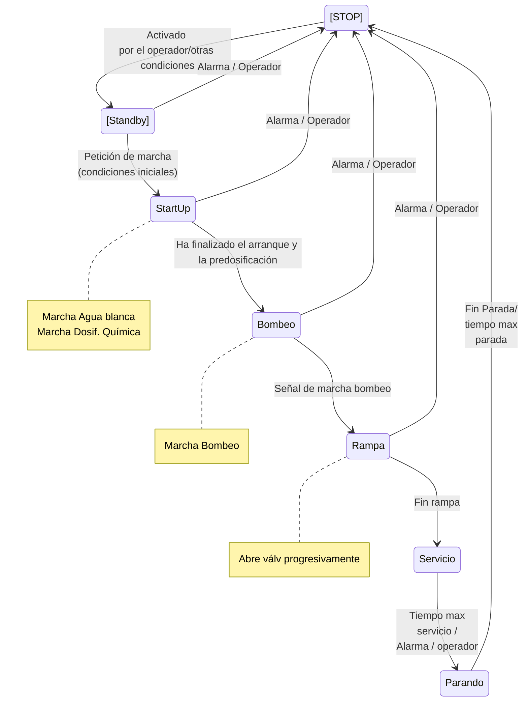

# Notas sobre la descripción funcional del DAF 1A

El propósito de este documento es complementar y aclarar algunas dudas que pudieran surgir al implementar el control a partir del documento "**12008579136 CEPSA REV 1.2 20250623 DAF-1A**".

## Secuencia

1. Se dan condiciones para enviar agua al DAF (niveles "adecuados" en tanques previos y posteriores al DAF, están los equipos de químicos disponibles).
2. Se da orden de marcha al DAF.
3. Se arranca el bombeo y la producción de agua blanca.
4. Se arranca la dosificación química.
5. Se da permiso al bombeo al DAF.

### Señales a intercambiar con el resto del sistema

| Señal | Origen | Destino |
| ----- | ------ | ------- |
| Condiciones de Paro | DAF | Sistema |
| Orden de marcha/paro al DAF | Sistema | DAF |
| Permiso para bombear | DAF | Sistema |
| Bombeo en marcha | Sistema | DAF|

### Condiciones

#### Condiciones de Paro

El sistema se detiene si se activa el bit la alarma DAF_ALARM que se define en la descripción funcional.

- Paro de emergencia
- Selección de operador
- Tiempo máximo de funcionamiento
- Alarma disparada por `BR7-PS0021A_AHH` o `BR7-PS0021A_ALL`
- Alarma disparada por `BR7-LS-007A`
- Alarma de alto nivel en el depósito de efluente BR7-LT-0014A_AH
- Alarma de alto nivel en el depósito de fangos BR7-LT-0015A_AH
- Alarma de bajo nivel disparada por `BR7-LS-0008A` (con retardo de 120 seg)
- No se tiene disponible la rasqueta
- No se tiene disponible ninguna bomba de recirculación (BR7-P-0214A/B)
- No se tiene disponible el bombeo de efluente. Eso incluye la bomba (BR7-P-0204A), válvulas (BR7-LV-0014A, BR7-UV-0330, BR7-UV-0329), depósitos de destino, enclavamientos, etc.
- No se tiene disponible el bombeo de fangos. Esto incluye la bomba (BR7-P-0201A), la disponibilidad del depósito BR7-T-0111, enclavamientos, etc.
- Disponibilidad de la dosificación de coagulante, si está seleccionada.
- Disponibilidad de la dosificación de poli, si está seleccionada.

- Alarma LL o HH del pH en el tanque de coagulación `BR7AT  0011A_58A_cntrl` (`BR7AT 0011A` / `BR7AT 0058A`). 

Aunque no se considera como parte del bit de alarma DAF_ALARM, otra condición de paro será:

- Se tiene alarma LL en el caudalímetro de entrada BR7-FT-0006A. 

#### Condiciones Iniciales

No se tiene condición de Paro

#### Condiciones de Marcha

No corresponde a VWT establecer las condiciones de marcha del equipo. Será por operador, de manera automática o según se establezca; pero en todo caso se deberá respetar la secuencia de arranque del equipo antes del arranque del bombeo.

### Etapas

#### Start up

En esta etapa se ponen en marcha los siguientes equipos:
- Bomba de agua blanca (BR7-P-214A/B)
- Agitadores BR7-AG-0201A, BR7-AG-0202A
- Rasqueta BR7-Z-0201A
- Bombeo de coagulante, si se ha seleccionado desde el SCADA.
- Bombeo de poli, si se ha seleccionado desde el SCADA.

Dado que durante esta fase no existe caudal de entrada, 

Tras un tiempo con todos los equipos arrancados, se pasa a la etapa de "**Bombeo**"

#### Bombeo

**PARÁMETROS**

| TAG | DESCRIPCIÓN | UNIDAD | VALOR INICIAL |
| ---- | ---------- | ------ | ------------- |
| `FV-0006A_spos_ini_start_up` | Posición inicial válvula | % | 10 |
| `FT-0006A_ini_start_up` | Caudal mínimo para pasar de fase |  m3/h | 3 |
| `T_FV-0006A_pos_ini_start_up` | Tiempo para pasar de fase | seg. | 60 |
| Tiempo máximo fase bombeo | Tiempo máximo durante la fase de bombeo | min | 5 |

Al entrar en esta etapa, se abre la válvula BR7-UV-0301.

Se abre la válvula BR7-FV-0006A hasta una posición inicial `FV-0006A_spos_ini_start_up` a establecer en las consignas en el SCADA. 

Una vez se abre hasta la posición deseada, se da permiso al bombeo para que arranque. 

Al iniciarse el bombeo se empieza a leer caudal en BR7-FT-0006A. Cuando el caudal supere el valor `FT-0006A_ini_start_up` durante un tiempo `T_FV-0006A_pos_ini_start_up` se inicia la siguiente etapa.

Al iniciar la etapa de bombeo se arranca un temporizador/contador. Si está en la etapa de bombeo durante un tiempo consignable (**Tiempo máximo fase bombeo**) sin que haya pasado a la siguiente fase, se aborta el arranque y pasa a **STOP**. 

#### Rampa

**PARÁMETROS**

| TAG | DESCRIPCIÓN | UNIDAD | VALOR INICIAL |
| --- | --------------- | --------- | ------ |
| `BR7-FC-0006A_SP` | Caudal deseado en la fase de "**Servicio**" | m3/h | 35 |
| `Tim_SP_FC-0006A` | Tiempo de duración de la rampa | seg. | 60 |
| `Tim_Int_FC-0006A` | Tiempo de intervalo para refrescar el SP en el PID | seg. | 10 |

**TEMPORIZADORES/CONTADORES**

| TAG | DESCRIPCIÓN | UNIDAD | VALOR INICIAL | VALOR FINAL |
| --- | --------------- | --------- | ------ | ------ |
| `Tim_Cta_FC-0006A` | Contador de tiempo de rampa | seg. | 0 | `Tim_SP_FC-0006A` |
| `Tim_Cta_Int_FC-0006A` | Contador de intervalo para refrescar el SP en el PID | seg. | `Tim_Int_FC-0006A` | 0 |

Para el control del caudal al DAF existe un PID cuyo SP de caudal será `BR7-FC-0006A_SP` que normalmente opera en *automático*. 

Durante la fase de **Rampa** la consigna de PID va a aumentado desde el valor `FT-0006A_ini_start_up` al valor `BR7-FC-0006A_SP` durante el tiempo consignado `Tim_SP_FC-0006A`. 

Cuando se inicial la fase de rampa, dos contadores incrementales se ponen en marcha: 
- Un contador incremental `Tim_Cta_FC-0006A` desde 0 a `Tim_SP_FC-0006A`
- Un contador decremental `Tim_Cta_Int_FC-0006A` desde `Tim_Int_FC-0006A`a 0. 

Durante la fase de rampa se realiza el siguiente cálculo:

 `SP_Rampa_FC-0006A` = ((`BR7-FC-0006A_SP` - `FT-0006A_ini-start-up`)/ `Tim_SP-FC-0006A`) * `Tim_Cta_FC-0006A` + `FT-0006A_ini-start-up`

El contador `Tim_Cta_Int_FC-0006A` al llegar a 0 se resetea, y cada vez que llega a cero se actualiza en el bloque PID el valor del SP de caudal por `SP_Rampa_FC-0006A`

Una vez finaliza la cuenta `SP_Rampa_FC-0006A`, se pasa a la estapa de **Servicio**.

#### Parando

**PARÁMETROS**

| TAG | DESCRIPCIÓN | UNIDAD | VALOR INICIAL |
| --- | --------------- | --------- | ------ |
| `Tim_Rasqueta_parando` | Tiempo en marcha de la rasqueta durante la fase "**Parando**" | min. | 5 |
| `Tim_Espera_Bombeo_Efluente` | Tiempo de espera para arrancar el bombeo del efluente durante la fase "Parando" | min. | 3 |
| `FT-0006A_MIN` | Caudal mínimo antes de pasar de fase | m3/h | 2 |

En esta etapa se quita la señal de permiso de marcha del bombeo para que se pare y deje de entrar caudal y se detienen los siguientes equipos:

- Bomba de agua blanca (BR7-P-214A/B)
- Agitadores BR7-AG-0201A, BR7-AG-0202A
- Dosificación de químicos seleccionados (coagulante, floculante y regulación de pH)

Durante la fase de parando se mantiene la rasqueta durante un tiempo y se vacía la cámara de fango. 

Se establece un tiempo de rasqueta en marcha durante la fase "parando" (`Tim_Rasqueta_parando`). Al finalizar este tiempo la rasqueta se detiene.

Durante la fase "parando" se pone en marcha el bombeo cuando ha transcurrido el `Time_Espera_Bombeo_Efluente` o bien se ha alcanzado el nivel mínimo para el arranque durante la fase de parada (`BR7-LT-0015A_Lact` > `BR7-LT-0015A_H_Parando` durante unos segundos) y se espera a que el nivel llegue a su nivel más bajo (`BR7-LT-0015A_Lact` < `BR7-LT-0015A_L_Parando` durante unos segundos).

Si la rasqueta no está disponible, se salta el tiempo `Tim_Rasqueta_parando`.

### Transiciones

Todas las transiciones contarán con un pulsador para poder avanzar de etapa por decisión del operador, además de un temporizador para evitar que el sistema se quede "atascado" en alguna etapa sin que el operador se percate de ello.

#### Condiciones para la transición STOP --> Standby

o corresponde a VWT establecer las condiciones de esta transición, pero no debe tener activo el bit de alarma DAF_ALARM.

#### Condiciones para la transición Standby --> Start Up

- Decisión del operador (botón "START")
- Condiciones de marcha ("DAF_DEM"). Este bit se activa por las condiciones de los equipos **externos** al DAF en la secuencia del conjunto de la planta y que quedan fuera del alcance de esta descripción, pero tendrán que tener en cuenta, al menos, lo siguiente:
  - Nivel de los tanques previos de donde se va a bombear el agua hacia el DAF
  - Temperatura del influente a enviar al DAF.

#### Condiciones para la transición Start Up --> Bombeo

- Se han arrancado los equipos del DAF:
  - Bombeo de agua blanca (BR7-P-0214A/B)
  - Agitadores BR7-AG-0201A, BR7-AG-0202A
  - Rasqueta BR7-Z-0201A
  - Se ha iniciado la dosificación.
  - Con los equipos arrancandos y dosificaciones seleccionadas en marcha, ha pasado el tiempo `T_wait_ini_start_up`.
- O bien está entrando caudal de forma que `BR7-FT-0006A` > `FT-0006A_ini_start_up`

#### Condiciones para la transición Bombeo --> Rampa

  - Se ha abierto la válvula BR7-FV-0006A hasta su posición inicial.
  - Ha arrancado el bombeo.
  - El caudal medido en BR7-FT-0006A supera determinado valor durante un tiempo determinado (`BR7-FT-0006A` > `FT-0006A_ini_start_up`).

#### Condiciones para la transición Rampa --> Servicio

- Ha finalizado el tiempo de rampa. 

#### Condiciones para la transición Servicio --> Parando

Si se cumplen alguna de las siguientes condiciones:

- Ha finalizado el tiempo máximo de servicio.
- Se ha producido una alarma de paro (DAF_ALARM).
- Decisión del operador.
- Valor bajo en el caudalímetro de entrada

#### Condiciones para la transición Parando --> Stand-by

Se han de cumplir las siguientes condiciones

- Se ha terminado el tiempo de rasqueta (si la rasqueta está disponible).
- Se ha vaciado el depósito de fangos (`BR7-LT-0015A_Lact` < `BR7-LT-0015A_L_Parando`, si el bombeo de fangos está disponible).
- El caudal de entrada está por debajo de un valor mínimo de parada.

O bien:

- Pulsador en pantalla para forzar la finalización de la etapa.

#### Condiciones para la transición a STOP

- Si no está en Servicio, se ha producido alguna alarma en el sistema o decisión de operador.
- Si está en Servicio ha de pasar por la etapa de Parando.

## Notas a la instrumentación 

### Analógicas (no PT)

#### BR7-FT-0006A. Caudal de entrada

Parámetros asociados

| TAG | Descripción | Acción | Valor  (m3/h) |
| --- | ----------- | ----- | ------ |
| `FT-0006A_ini_start_up` | Valor de arranque de rampa | Si en fase de "Bombeo" durante el tiempo `T_FV-0006A_pos_ini_start_up` se cumple que `BR7-FT-0006A` > `FT-0006A_ini_start_up` pasa a la fase de rampa | 4 |
| `FT-0006A_MIN` | Caudal mínimo antes de pasar de fase | Si en fase de "Parando" durante un tiempo dado el caudal de entrada es inferior a este valor, se permite cerrar válvulas de entrada y pasar a la fase de "Stand-by" o "STOP". Si está en la fase de servicio irá a la fase de "Parando". | 4 |

#### BR7-LT-0015A: Nivel del depósito de fangos.

Parámetros asociados 

| TAG                    | Descripción                                             | Acción                                              | Valor (%) |
| ---------------------- | ------------------------------------------------------- | --------------------------------------------------- | --------- |
| BR7-LT-0015A_HH        | Nivel de alarma de paro del DAF (DAF_ALARM)             | Paro del DAF (DAF_ALARM)                            | 90        |
| BR7-LT-0015A_LMax      | Nivel correspondiente a la velocidad máxima de la bomba | N/A                                                 | 60        |
| BR7-LT-0015A_H_Serv    | Nivel de arranque del bombeo en fase de servicio        | Arranque del bombeo de fangos en fase de "Servicio" | 50        |
| BR7-LT-0015A_LMin      | Nivel correspondiente a la velocidad mínima de la bomba | N/A                                                 | 30        |
| BR7-LT-0015A_H_Parando | Nivel de arranque del bombeo en fase de parando         | Arranque del bombeo de fangos en fase de "Parando"  | 15        |
| BR7-LT-0015A_L_Serv    | Nivel de paro del bombeo en fase de servicio            | Paro del bombeo del fango en fase de "Servicio"     | 10        |
| BR7-LT-0015A_L_Parando | Nivel de paro del bombeo en fase de parando             | Paro del bombeo de fango en fase de "Parando"       | 7         |
| BR7-LT-0015A_LL        | Nivel de protección del bombeo de fangos                | Enclavamiento (paro) del bombeo de fango            | 5         |

#### BR7-LT-0014: Efluente (agua limpia). 

PARÁMETROS

| TAG | Descripción | Acción | Valor (%) |
| --- | ----------- | ------ | ------|
| BR7-LT-0014_HH | Nivel de alarma de paro del DAF | Paro del DAF (DAF_ALARM) | 95 |
| BR7-LT-0014_H | Nivel de arranque del bombeo de efluente | Marcha bombeo efluente | 80 |
| BR7-LC-0014_SP | Nivel de consigna del bombeo del efluente | N/A | 50 |
| BR7-LT-0014_L | Nivel de paro del bombeo de efluente | Paro bombeo efluente | 20 |

#### pH-metros y los transmisores.

Hay 2 transmisores:

- BR7-AT-0013A que coge la señal del pH-metro AE-0013A y que la envía junto a la señal de temperatura. Se mide en línea. Tal y como se ve en el P&ID se dan dos señales: 

  - BR7-AI-0013A (pH) y BR7-TI-0055A (temperatura).

  El sistema incluye un módulo de limpieza, como muchas sondas de las que pone Worley. Además de las dos salidas analógicas (4-20 mA), el transmisor-controlador incluye unas salidas relé, que deberán ser configuradas de manera análoga a como se describe en Worley. Hay que considerar al menos una salida relé.

- BR7-AT-0010A que coge la señal de los siguientes equipos:
  - AE-0010A: sólidos en cámara de coagulación
  - AE-0011A: pH en cámara de coagulación
  - AE-0012A: sólidos en salida (cámara con el efluente limpio)
  - AE-0058A: pH en cámara de coagulación (redundante con el 11)

Para que sea coherente con el resto de descripciones de VWT, la redundancia de los transmisores se realizará una media de los 2 como valor "válido", como se explica más adelante.

PARÁMETROS

| TAG                            | Descripción                                       | Acción                           | Valor (pH) |
| ------------------------------ | ------------------------------------------------- | -------------------------------- | ---------- |
| BR7AT  0011A_58A_HH            | Alarma de alto pH                                 | Paro del sistema (DAF_ALARM)     |            |
| BR7AT  0011A_58A_cntrl_H_acido | Consigna de arranque de la dosificación de ácido. | Arranca la dosificación de ácido |            |
| BR7AT  0011A_58A_cntrl_acido   | SetPoint para el PID del ácido                    | N/A                              |            |
| BR7AT  0011A_58A_cntrl_L_acido | Consigna de paro de la dosificación de ácido.     | Paro de la dosificación de ácido |            |
| BR7AT  0011A_58A_cntrl_H_sosa  | Consigna de paro de la dosificación de sosa.      | Arranca la dosificación de sosa  |            |
| BR7AT  0011A_58A_cntrl_sosa    | SetPoint para el PID de la sosa                   | N/A                              |            |
| BR7AT  0011A_58A_cntrl_L_sosa  | Consigna de arranque de la dosificación de sosa.  | Paro de la dosificación de sosa  |            |
| BR7AT  0011A_58A_LL            | Alarma de bajo pH                                 | Paro del sistema (DAF_ALARM)     |            |

 Para los sólidos se pondrán puntos de aviso (H y HH). 

Está previsto que el transmisor tenga una salida relé que será una entrada digital para indicar que no hay ninguna alarma en el mismo.

#### BR7-FT-0117A: Caudalímetro de recirculación

Se usa únicamente para monitorizar el caudal de recirculación. Tendrá puntos de alarma y aviso (LL, L, H y HH), pero la alarma no implica ninguna actuación automática.

### El cuadro neumático y sus instrumentos

Hay dos transmisores de presión con salidas digitales:

**PT/PS-0021. ISE20C.** Está conectado al vessel o reactor. Tiene 5 hilos: positivo, negativo, salida transistor 1, salida transistor 2 y salida analógica.

Señales:

- BR7-PSH-0021A. Señal digital para alarma de alta presión.

- BR7-PSL0021A. Señal digital para alarma de baja presión.

- BR7-PT-0021A. Señal analógica de la presión en el vessel. 

**PT/PS-0550. ISE20B.** Está conectado a la entrada de aire comprimido. Tiene 4 hilos: positivo, negativo, salida digital transistor y salida analógica.

- BR7-PS-0550A. Señal digital para alarma de baja presión de aire comprimido.

- BR7-PT-550A. Señala analógica de la presión en la entrada de aire comprimido.

### Señales digitales

Además de estas señales mencionadas, hay que contemplar otras dos señales digitales:

#### BR7-LS-0007A: Alarma de rebose del DAF

Este sensor de nivel se coloca en la cámara de coagulación. Si da nivel alto deberá parar el bombeo del DAF. 

#### BR7-LS-0008A: Detector de nivel en el vessel

Este sensor se utiliza para la entrada de aire al vessel y comprobar si el bombeo de recirculación funciona correctamente.

### Habilitación de alarmas analógicas y digitales

| **Tag** | **Descripción** | **Condiciones de habilitación** |
| ------ | ------------ | ---------------- |
| BR7-FT-0006A | Caudal de entrada al DAF 1A | No está activo el final de carrera BR7ZSL  0301 ni la posición de la válvula de regulación BR7ZT   0006A es cero |
| BR7-LT-0015A | Nivel en cámara de fango del DAF 1A | Siempre |
| BR7-LT-0014A | Nivel en cámara de agua tratada del DAF 1A | Siempre |
| BR7-LS-007A | Nivel en cámara de coagulación del DAF 1A | No está activo el final de carrera BR7ZSL  0301 ni la posición de la válvula de regulación BR7ZT   0006A es cero |
| BR7-LS-0008A | Nivel alto en el calderín BR7-V-0201A  | Alguna de las bombas BR7-P-0214A/B está en marcha |
| BR7-PS0021A_AHH | Señal DIGITAL de alta presión en el calderín BR7-V-0201A | Siempre |
| BR7-PS0021A_ALL | Señal DIGITAL de baja presión en el calderín BR7-V-0201A | Alguna de las bombas BR7-P-0214A/B está en marcha. La ALARMA tiene un retardo de 40 s |
| BR7-PS0550A | Señal DIGITAL de presión en la línea de aire | Siempre |

## FUNCIONAMIENTO DE LA SECUENCIA DE AIRE EN EL VESSEL

### Operación de la válvula de entrada de aire al vessel UV-0327A:

Condiciones de apertura de la válvula UV-0327A (AND):

- Está en marcha el bombeo de *agua blanca* con alguna de las bombas P-0214A/B.

- No hay señal `BR7-PS0021A_AHH` ni `BR7-PS0021A_ALL`.

- Está activado el `PS0550A`. 

- El DAF está en Start-Up, Bombeo, Rampa o Servicio.

- No tiene alarma de parada de DAF.

- El nivel LS-0008A está alto (activado) durante 20 s.

  

Condiciones de cierre de la válvula UV-0327A (OR)

- No está en marcha el bombeo de *agua blanca* con alguna de las bombas P-0214A/B.

- Hay señal `BR7-PS0021A_AHH`.

- No está activado el PS-055A. 

- El DAF no está ni Start-Up, ni en Bombeo, ni en Rampa ni en Servicio..

- El nivel LS-0008A está bajo (desactivado) durante 5 s.

- Tiene alarma de parada de DAF.

### Operación de la válvula de salida de aire del vessel UV-0328A

Condiciones de apertura de la válvula UV-0327A (AND):

- Hay señal `BR7-PS0021A_AHH` durante 3 seg.

- El DAF no está parado por el operador.

- El DAF está en la fase de "*parando*".

Condiciones de cierre de la válvula UV-0327A (OR):

- No hay señal `BR7-PS0021A_AHH` durante 3 seg.

- El DAF está parado por el operador.

Si el sistema está en las etapas de "Parando", con el bombeo de recirculación detenido; "Stand-By" o "Stop"; la válvula permanece abierta. 

## Válvulas de purga

Existen 4 válvulas de purga BR7-UV-0323A, BR7-UV-0324A, BR7-UV-0325A y BR7-UV-0326A; situadas debajo de los tolvines del DAF. El propósito de estas válvulas es extraer el fango decantado en el equipo. 

Variables asociadas:

Existen las siguientes consignas (a fijar por el operador):

- Tiempo de espera para abrir una válvula de purga. En minutos u horas. `UP201A_T_espera_valv_purga`
- Tiempo de apertura de válvula. En segundos o minutos. `UP201_T_apertura_valv_purga`
- Tiempo de espera entre apertura de válvulas. En segundos. `UP201_csgT_espera_purga`

Cada válvulas contará con las siguientes variables internas:

- Contador de tiempo de espera para abrir. En minutos u horas. `UV0323AT_espera`, `UV0324AT_espera`, `UV0325AT_espera` y `UV0326AT_espera`.
- Contador de tiempo de válvula abierta. En segundos. `UV0323AT_apertura`, `UV0324AT_apertura`, `UV0325AT_apertura` y `UV0326AT_apertura`.

Durante la fase de servicio cada contador de válvula irá incrementando el contador de tiempo de espera para abrir. Cuando el contador de este tiempo de espera sea superior a la consigna de tiempo de espera para abrir (`UV032xAT_espera` > `UP201A_T_espera_valv_purga`) se levanta un bit para pedir la apertura ( `UV0323Ab_apertura`, `UV0324Ab_apertura`, `UV0325Ab_apertura` y `UV0326Ab_apertura`) y se mete en una cola.

Si está activo el bit `UP201_bpermisoT_espera_purga`, se abre la válvula que esté la primera de la cola y se empieza a contar el tiempo de válvula abierta (`UV0323AT_apertura`, `UV0324AT_apertura`, `UV0325AT_apertura` y `UV0326AT_apertura`). Cuando dicho tiempo sea mayor o igual a la consigna `UP201_T_apertura_valv_purga`, la válvula se cierra y se saca de la cola.

Al finalizar el tiempo de apertura de válvula y está cerrada, se desactiva el bit `UP201_bpermisoT_espera_purga` y empieza a contar el tiempo `UP201_ctaT_espera_purga`. Cuando dicho tiempo sea mayor o igual que `UP201_csgT_espera_purga` se activa el bit `UP201_bpermisoT_espera_purga`. 

Si durante la apertura de la válvula se para la bomba BR7-P-0201A, se cierra la válvula y se queda en espera hasta que vuelva a arrancar y se congela la cuenta de tiempo de válvula abierta (no se desactiva el bit `UP201_bpermisoT_espera_purga` ni se modifica la cola).

Esta purga automática no está permitida durante las fases de STOP ni Standby.

## Bombeo de recirculación  (BR7-P-214A/B)

Como se ha dicho antes, el bombeo se arranca durante la etapa de start-up y permanece en marcha hasta la etapa de parando. La selección de la bomba que arranque puede ser según la selección del operador o para igualar los tiempos de funcionamiento. En caso de que sea la primera opción, tras un periodo de inactividad de una bomba (a consignar por el operador), se deberá dar un aviso para su arranque, al menos en manual, durante cierto tiempo de forma que se evite que un equipo que está a la intemperie esté parado durante mucho tiempo.

Si el equipo que está como principal entra en fallo, el equipo de reserva entra en servicio sin modificar la secuencia. 

En caso de que se active la señal `BR7-PS0021A_ALL` el equipo de reserva se pondrá en marcha. Se tendrá un selector en la pantalla para que en caso de que entre el equipo de reserva de apoyo, se pare el principal o siga en marcha.  

Si la señal `BR7-PS0021A_ALL` está activa durante un tiempo determinado (a consignar por el operador, normalmente 40 seg.), se activará la alarma de paro del DAF y detiene el sistema por completo.

## Bombeo de Efluente

El bombeo de efluente arranca y para con el nivel de fangos. Se realizará un PID para mantener el nivel constante con la válvula BR7-LV-0014A. 

Habrá que tener en cuenta la posición de las válvulas BR7-UV-0329/0330 y los niveles en los tanques de destino (fuera del alcance de VWT).

## Bombeo de Fangos

Existirán las siguientes variables para controlar el bombeo de fangos:

| TAG                    | Descripción                                             |
| ---------------------- | ------------------------------------------------------- |
| BR7-LT-0015A_vSP       | Velocidad de la bomba                                   |
| BR7-LT-0015A_vMax      | Velocidad máxima correspondiente al nivel máximo        |
| BR7-LT-0015A_vMin      | Velocidad mínima correspondiente al nivel mínimo        |
| BR7-LT-0015A_Lact      | Nivel actual del depósito                               |
| BR7-LT-0015A_LMax      | Nivel correspondiente a la velocidad máxima de la bomba |
| BR7-LT-0015A_LMin      | Nivel correspondiente a la velocidad mínima de la bomba |
| BR7-LT-0015A_H_Serv    | Nivel de arranque del bombeo en fase de servicio        |
| BR7-LT-0015A_L_Serv    | Nivel de paro del bombeo en fase de servicio            |
| BR7-LT-0015A_H_Parando | Nivel de arranque del bombeo en fase de parando         |
| BR7-LT-0015A_L_Parando | Nivel de paro del bombeo en fase de parando             |
| BR7-LT-0015A_LL        | Nivel de protección del bombeo de fangos                |

Como se indica en la descripción de control, la velocidad de la bomba es proporcional al caudal. 

Existen dos niveles de arranque y paro, un par durante la fase de "servicio" y otro durante la fase de "parando", que serán sensiblemente inferiores a éstos, ya que lo que se quiere conseguir es que se vacíe el depósito tras el paro.

La regulación de velocidad tendrá forma de "S" 

![Chart, line chart  Description automatically generated](data:image/png;base64,iVBORw0KGgoAAAANSUhEUgAAAwoAAAGKCAYAAACsF7bQAAAQAElEQVR4AezdDYyb933Y8R9Tx5NnB5OWNnZTN7m4pOFoTqqDl1UiW9Ta3E3kFelpWwW56WApXUkbRXfUCgHSIMRSZkAqhFQ8ZJlNBoskrIkNpYMOW3VUN6PnoSGlNc1OmFXFEG/OLfVaO0shAUlq1fNy+/8evj0P+fDuSD4kn5evfM+RfF7+L5//SX5+9zy///OeNf4ggAACCCCAAAIIIIAAAh0C7xH+IIBAyAToDgIIIIAAAgggMLwAgcLwhpSAAAIIIIDAaAUoHQEEEJiAAIHCBNCpEgEEEEAAAQQQQCDaAkHoPYFCEEaJNiKAAAIIIIAAAgggMGYBAoUxg1Nd0AVoPwIIIIAAAgggEA2BYAUK5ZzEYjFJza+0R8dtXXvr8O9WbHVtUNrKfMpqX668wY6OzSsyn4pZx8Vi+pqTvg53lLXZD2XJWXVpfWZJzcvme7nZOtgPAQQQCIgAzUQAAQQQcBUIVqDg2oXRrbRO/BMJiY3jRDqZlcLioiwuHpZEq0uNE/p16rfaaE76+wtO0nLYqqsg2aSprHpDauaFLwQQQAABBBBAIAwC9MEbAQKF9RwffrS+9dGHJV5/N8Lv22UmnZZ0Oj6GukTiVl0zsn2EPaJoBBBAAAEEEEAAgeAKECisM3bxdFHW1tZkrZheZy82eSdASQgggAACCCCAAAJ+ESBQ8MtI0A4EEEAgjAL0CQEEEEAgsAJ9Bwor5ZykYrF28m0qJfP27FuzPRaLiXXP/EpZcqn2vqlc76RZq1zbvrFUzpTbZ4qtVV89oTgWi8nQ9TX64kietoZ6Rcq5VNvBMuizrVY5o/jWmRzd9h9LrsUoukSZCCCAAAIIIOAbARoSHYG+AgVNnE1kSlJtJd4WJGusLtzsPkm+vpCTWCIjJUlKNpuVZFKkWspLItUdLJRzMdFyxZRmJfQWzP5SknwmUQ84TB0bfl14SlJWfaaUkdanJ+IJyZSqxqHet6xUrbYm8lWZ/J+4PLwva5mre30x+JNvGC1AAAEEEEAAAQQQCJBAH4HCily6oCfCWVmsFGUurYm3c1KsVKQy153qWy2ZEKFQkzWzvVgsSqVSk4Ker1YvyCV7XFHOmZNuI5ZdNPs0yp3T/RdFg5BSZnPThVarpm3jqK98Wqx4IFmQWqNvxcqa1Ba1taYfo/gyZqdzOcm5LKetMXFWmjZ+at5cZsXYiEj22NxYEqWdreETAggggAACCCCAQBAF+ggUmt27Li4XEJob26964u8IIOIysy9ptlflhm0uzvJCyaxLSuFwZ8JwWmatc29/1Vdvr3SddGvic82KhEx3PP+qSskEXq5LdYPKbIFYsZN4g0PZjAACPhegeQgggAACCIxQoI9AIS5zx/TMvSr5REpy8+V1H9KV3J7o2ezrrUhjRW5eb+xWK0u57FxuStJsdAYWZoXr13jqa7Y3K7PjPOlOmqsXOvuSy1JbNzgpSy6jgZi5CkSU4Ppzw0oEEEAAAQT8JEBbEPCTQB+Bgml2umjdYpNMmt9w5zOS2CBh2ByxwVdNblR1FxN8ZDKS6VjyJWuj7uDRMmx9zeM9as6Ii1mZf040TEgWDss44xrhDwIIIIAAAggggEDgBfoLFEx39RabSmVN1mqLok/17ZWgbHbdxFdCtid1N/Mbb5ffllvPMDDrvftl+LD1NY/XNtsXH75fmZenNJkiWZDzjlvAfNhWmoQAAggggAACCCDgO4G+A4VWD+JpKbYSlG+ILe2gtcvGb+JSf/jxJvMQNi5wgz2Gra95fEkW7FPCblDr+DevyPxTealKUgrnSWAevz81hkKATiCAAAIIIBBxgT4ChbLkUjkp22cs8gAvbWUsVyX/VPe0qSIrUt4gF6LfJgxbX6J+CURKHZGCNXWs/ga/3waNYv/GzEzJwnnhYsIogCkTAQQQQCCIArQZAQT6E+gjUDAFV0uSSeiDzOpTdaZiCWuq0OQw98CnD4uVj1vNSyKWklRzCtBUTGKm/MyFm+LpnyHri88dE03pllJGYqmUNWVpyrRVn6GQ1XuxPG3sIIWZgC5jZSaI3Dhtta89req8+PpCyCDd5RgEEEAAAQQQQACBkQj0ESikpVhblII5GdZnJOhUndVkUrKFmutzFDbf2rjMVWqyqA9ZS1alWXapmpRkdlFq572+dWbY+ozDWs1ykGrVmra0akKHQm1NirOPbr7bI9/TZlkqWe0slS5sbmrbkbeNChBAAAEEEEAAAQT8LtBHoGC6Ek/LXLEizSRj62Fqnfe2pIvWdreHsMXn6sd2b4uLPiTMSpJeW7OOX1urSKWYlnhc2n/cynZb1zhiJPVZZZtgw+FQrN/i02iLaba11/DfNCgxHpXewVKzj+06G8e0HM3xrfeVejuHbxglIDCcAEcjgAACCCCAgO8F+gsUfN8dGogAAggggAACkxCgTgQQCJ8AgYJvxvSGXLIeOLciHueLu/Zwxarrktxw3cpKBBBAAAEEEEAAgYgLCIGCX34CqiXJZ/Shc6cHnGq2n46U5bRVV16sZ9olt0uin8PZFwEEEEAAAQQQQCD0AgQKEx/iuMxV7HkExTE8Rbkjj6HSOwdi4jw0oH8BjkAAAQQQQAABBDwQIFDwAJEiEEAAAQQQGKUAZSOAAAKTECBQmIQ6dSKAAAIIIIAAAghEWSAQfSdQCMQw0UgEEEAAAQQQQAABBMYrQKAwXm9qC7oA7UcAAQQQQAABBCIiQKAQkYGmmwgggAAC7gKsRQABBBBwFyBQcHdhLQIIIIAAAggggEAwBWi1RwIECh5BUgwCCCCAAAIIIIAAAmESIFAI02gGvS+0HwEEEEAAAQQQQMA3AgQKvhkKGoIAAgiET4AeIYAAAggEV4BAIbhjR8sRQAABBBBAAIFxC1BfhAQIFCI02HQVAQQQQAABBBBAAIHNChAobFYq6PvRfgQQQAABBBBAAAEE+hAgUOgDKyy73vr+O2HpCv1AINICdB4BBBBAAIFRChAojFLXh2W/8+4P5be++HUhWPDh4NAkBBBAAIGoC9B/BHwlQKDgq+EYfWO+8srr8tbtt+ULv//a6CujBgQQQAABBBBAAIHAChAoeDF0ASlDA4TFr78h9265S177s9vy6uqtgLScZiKAAAIIIIAAAgiMW4BAYdziE6zvi5dr8ss/OyX3bXmv/FPzWirfnGBrqBoBfwvQOgQQQAABBKIuQKAQkZ8AvXqgVxF+adeHrB7v+uiPyf3b7pGFK9+2PvMNAQQQQACBkAvQPQQQ6FOAQKFPsKDurlcPfuMXH5G772oP+YEnfkp+72urJDYHdVBpNwIIIIAAAgggMEKB9lnjCCsZqmgOHlpArxrcd89dsuujH3CU9eCP3is//7EHRBOcHRv4gAACCCCAAAIIIBB5AQKFkP8I/ODOu9ZVg1/f87BrT596Ii5Xvvkdef3N77luZyUCoxCgTAQQQAABBBDwvwCBgv/HaKgW6tUCvWrw0APvcy1Hb0U6YIKFL/wnpkt1BWIlAggggMBmBNgHAQRCKECgEMJBbXZJrxL811fftGY4aq5ze31i+oOiD2LTfd22sw4BBBBAAAEEEEAgagIiBAohHvPyn/xvK0jYdt/dG/by0N7t8h+v/tmG+7EDAggggAACCCCAQDQECBRCPM46y9FsYzrUjbqptyZ97tc/sdFubA+AAE1EAAEEEEAAAQS8ECBQ8EKRMhBAAAEEEBidACUjgAACExEgUJgIO5UigAACCCCAAAIIRFcgGD0nUAjGONFKBBBAAAEEEEAAAQTGKkCgMFZuKgu6AO1HAAEEEEAAAQSiIkCgEJWRpp8IIIAAAm4CrEMAAQQQ6CFAoNADhtUIIIAAAggggAACQRSgzV4JECh4JUk5CCCAAAIIIIAAAgiESIBAIUSDGfSu0H4EEEAAAQQQQAAB/wgQKPhnLGgJAgggEDYB+oMAAgggEGABAoUADx5NRwABBBBAAAEExitAbVESIFCI0mjTVwQQQAABBBBAAAEENilAoLBJqKDvRvsRQAABBBBAAAEEEOhHgEChHy32RQABBPwjQEsQQAABBBAYqQCBwkh5KRwBBBBAAAEEENisAPsh4C8BAgV/jQetQQABBBBAAAEEEEDAFwIECh4MA0UggAACCCCAAAIIIBA2AQKFsI0o/UEAAS8EKAMBBBBAAIHICxAoRP5HAAAEEEAAAQSiIEAfEUCgXwEChX7F2B8BBBBAAAEEEEAAgQgI+D5QiMAY0EUEEEAAAQQQQAABBHwnQKDguyGhQQiEXoAOIoAAAggggEAABAgUAjBINBEBBBBAINwCr67eCngHaT4CCIRRgEAhjKNKnxBAAAEEAiVw5Ow3AtVeGosAAhEQMF0kUDAIfCGAAAIIIIAAAggggIBTgEDB6cEnBIIuQPsRQAABBBBAAAFPBCIdKJRzMYnFYpKaX3HBLEvObIvFclLWreWctW9OP6zMSy5VPzYWM8eblfUSVqQ8n5OUWReLme2pnLgWvWL2y6Xa+5l9U7l5qZehlZnF1GGVk+pYbzaVc6bsWMq9bLOdLwQQQACBYAl8/CPb1mkwmxBAAIHJCEQ6UEjPZi316oVLzpN0XVtekJK+Zmclra+N5fqCCRgSebMtK9lsVpJmfbWUkURuXuZTCcnkzVFmfTZptlRLkk90nNBrAJAw+5WqYgowX6YMa9e8JOxBQXxOjmVFpJqXp+zRRjknGVOFZI/JXNxs5wsBBBBAIPACJw88Fvg+0AEEEOhDICC7RjpQkPRhKZiTdKlekEuOX+eLlBf0bFwkO2sPE8x5e6kkyUJN1ipFKRaLUqkVrGBBSnnJV5NSqK1JxawvVipSqxcuF2yFr1y6YApdlNpaYz+zb6VSc21Hurgo9VjhdP2qhvmeq0cJslh0tisgP280EwEEEEAAAQQQQCAgAtEOFCQuM/usSMFxMm/CBKnHCVnpiBOsk/yK/Vf58RmxijDhQqFWcfyWPz6zz6wVqd6otX4c4nMVE0ikTc2tVeZNux22Xc36tBy2go2SZHJlKc8/JyWzNrtYdFzlMKv4Go8AtSCAAAIjEXiV6VFH4kqhCCAwnEDEAwWR1sm8/fajHrcdKXVye0JfbEtcHn7U9nHTb1dkZcWc/Jfry6Ub7gfG587XrzaUMpLJV8VczpDDXExwx2ItAggg0LeAPw5gelR/jAOtQAABp0DkAwUTKdSvCFTbtx/1uu3ISTfopxUp51ISiyUkkTAn/5n6ktecBdcim1cb6huzx+Y6rkbU1/MdAQQQQAABBBBAQERA8EyAQMGcdjtvPyrXbztKFkbym/tyLiEZExQks4tWnsLa2proUrNuMRKXP2U5rVcSJGn+EyllGrMwuezJKgQQQAABBBBAAAEEvBIgUDCSjtuPGrcdJffNmBDCbPT0qxGESFaOFTvzFNwrKucyUs9LOC/nrWCiJM/ZZ0FyPyyIa2kzAgggEDmB1dVVq8+Ln/0Fc6U5xhLDIBbDyryncwAAEABJREFUIBYbzGD37t3W3ye+eSdAoKCWzYTk6gU5bWUxJ2XfTFy3jGlZkUsXqt11rczLcxolWFc34hKfO2ZCDJFq/imeodCtxRoEEPCdAA1aT+Cll16Sj370o3Lq1Kn1dmMbAgggMDEBAgWLPt6a/ahknZjvk9HECen2LEb6MDZNZLYe0JYQ6+4iqy3Nbysy/1ReqpKUwvlmXkJaiovWhKmSf6r7QWzNI3lFAAEEEPC3wPHjx+XJJ5+UO3fuyNGjR/3dWFqHgF2A95ESIFBoDHd8pv7bev04mtuOtGQxVwXOy2IhK8lqSfKayJy/bk25WrMCgPo++n2lfLoePHQ+WK317Ie8nC7rnu3ly0uvy8yzL7eWMwvtqZReXv7z1vq3br8t/+4/tx8cYd+mx/c6jm3unn5zOXruG60fCp1yUdvXXNhWpwmDi/49bo6rvn76TKXeOfOdbe1/B/3mooGBBggnTpwwI8UXAgh4KaD/tuu/f16WGfWyCBSaPwFx89v6RmKx4zkJze3popV07LYtXVwz2yqOZyhYh8XnpKJlFu3zmcYlPVesr9dta43nKjTKb+4ab3xea66Q5p+4zFW0vjXp3PSp3Q/JpRNPtJZDs9ubB8kT0x9srb9/6z3ya/+wfWuVfZse3+s4trl7+s3l5IHHWuP+saltrXHXdrKtThMGF/17rGPaXL50KFXvnPnOtva/g35y+czen5Bdu3aJ3nJkhqn1tWXLFtnxT/6V+f9I/d92neCCBQt+Bvr/Gfjut66J/vvX+svFm6EFCBSGJqQABBBAYBIC1BkkgatXr1pBwrVr1xzNfuCBB2RpaUk++HdIwnTA8AEBBHwhQKDgi2GgEQgggAACYRXQKwg6G8ubb77p6OKOHTvkypUrsnPnTsd6PkRYgK4j4DMBAgWfDQjNQQABBBAIj4AmKmtOguYm2Hs1OztrBQlTU1PW6o9/ZJv1yjcEEEDATwIECsOPBiUggAACCCDgENDAYO/eva5Tnx45ckQuXrwompvQPMieP9RcxysCCCAwaQEChUmPAPUjgIAPBWgSAoML6EPUNGl5YWHBUYgGBi+++KKcPHnSsZ4PCCCAgF8FCBT8OjK0CwEEEEAgcAIbJS3v37/ftU86raPrBlZ6J0BJCCDQtwCBQt9kHIAAAggggEC3wHpJy8vLy+smLR85237+SXfJrEEAAQQmI+D3QGEyKtSKAAIIIIBAHwKHDh0St6RlvYKgMxvpNKh9FMeuCCCAgC8ECBR8MQw0AoEoCdBXBMIjcPv2bdGk5UKh0NWpZ599VjQnQXMTujayAgEEEAiAAIFCAAaJJiKAAAII+E9gdXVV9PkIvZKWjx8/vulGB3561E33lB0RQCBIAgQKQRot2ooAAggg4AsBTVqenp4Wtyct661GestRPw1letR+tNgXAQTGIaB1ECioAgsCCCCAAAKbFDh37px1JUFvO7IfsmPHDtGkZX21r+c9AgggEFQBAoWgjhztRsBVgJUIIDBKAU1aPnjwoOgD1ez16BUEvZIwaNIy06PaNXmPAAJ+ESBQ8MtI0A4EEEAAAd8K6NWDUSYtrzs9qm9VaBgCCIRdgEAh7CNM/xBAAAEEhhLQpOVeT1q+ePGi9JO0PFRDOBgBBEIjEJSOECgEZaRoJwIIIIDA2AVeeeUV0aTl1157zVH31NSU6K1Gs7OzjvV8QAABBMIkQKAQptGkLyMWoHgEEIiSwAsvvCDpdFr0tiN7v3fu3GkFCV4mLTM9ql2Y9wgg4BcBAgW/jATtQAABBBAYv0CPGjVp+ZlnnnFNWl5aWpJBk5Z7VCdMj9pLhvUIIDBJAQKFSepTNwIIIICArwT06oFeRSgUCl3tOnnyJE9a7lJhBQL+E6BF3gkQKHhnSUkIIIAAAgEWWF1dFU1avnz5sqMXW7ZsEU1aPnLkiGO9lx+YHtVLTcpCAAGvBAgUvJKknCEFOBwBBBCYnMCkk5aZHnVyY0/NCCDQW4BAobcNWxBAAAEEhhEIyLHrJS0vLy+Ll0nLASGhmQgggIAlQKBgMfANAQQQQCCKApqwrEvnk5YPHDggmrS8devWKLLQZwR6CrAhWgIECtEab3qLAAIIIGAENGl59+7dolcTzEfH15kzZ+Ts2bOiuQmODSP8wPSoI8SlaAQQGFiAQGFguiAdSFsRQAABBJoC+vA0TVrWvITmOn3VqweatJzP5/XjWBemRx0rN5UhgMAmBQgUNgnFbggggICvBGjMQAIaHGiQoMGCvYCpqSnrVqPZ2Vn7at4jgAACkRYgUIj08NN5BBBAIDoCepuR3m6ktx3Ze61PWp500jLTo9pHJLrv6TkCfhMgUPDbiNAeBBBAAAHPBTRhWZfOgg/4JGmZ6VE7R4bPCCDgBwEChaFHgQIQQAABBPwqoFcP9CqCXk3obOMkkpY728BnBBBAwM8CBAp+Hh3ahgACkxGg1lAIaB7C9PS0aF6CvUOatFwul2USScv2dvAeAQQQ8LsAgYLfR4j2IYAAAgj0LXD58mXRpOXV1VXHsZq0fOXKFdmzZ49j/aQ/MD3q6EeAGhBAoH8BAoX+zTgCAQQQQMDHAoVCQdLptOhtR/ZmPv7446JJy4888oh9tS/eMz2qL4aBRiCAQIeAzwOFjtbyEQEEEEAAgR4Cd+7cEU1YPnToUNceTz/9tOjtRnrbUddGViCAAAIIuAoQKLiysBIBBEYmQMEIjEBArx7oVYReScvPP/+8bNmyZQQ1e1Pkq6u3vCmIUhBAAAEPBQgUPMSkKAQQQACB8QuEIWk56NOjjn/UqREBBMYhQKAwDmXqQAABBBAYiUCvpGXNQ/Bj0vJIECgUAQQQ8F7AKpFAwWLgGwIIIIBA0ATWS1rWIEGDhaD1ifYigAACfhIgUPDTaNAWBIYV4HgEIiCgScsHDx6UXknLS0tLErSkZaZHjcAPLl1EIIACBAoBHDSajAACCERVQJOWd+/eLefOnesi0IRlXbo2BGDFetOjBqD5NBEBBEIqQKAQ0oGlWwgggEDYBK5duyb6pOWrV686uqZXD/Qqgk6B6tjABwQQQMCfAoFpFYFCYIaKhiKAAALRFVhYWBC9krC6uupA0DwEzUfQh6k5NgTsA9OjBmzAaC4CEREgUIjIQNNNDwQoAgEEJiKgSct79+4Vve3I3gANDjRI0GDBvj6I75keNYijRpsRCL8AgUL4x5geIoAAAoEUGEfSciBhaDQCCCAwJgEChTFBUw0CCCCAwOYF3nzzTetWo86kZX26siYs67L50tgTAQQiJEBXPRQgUPAQk6IQQAABBIYX0KTlXbt2iVvScrlcljAmLTM96vA/N5SAAALeCxAoeG9KiYMIcAwCCCBgBDRpWYMEt6Tl5eVl0bwEs1vovpgeNXRDSocQCIUAgUIohpFOIIAAAv4T6LdFp06dEk1a1twE+7F79uwRTVqempqyr+Y9AggggMCIBQgURgxM8QgggAAC6wtoYPDkk0/K0aNHu3bM5/OitxvpsxK6NoZoBdOjhmgww90VehcxAQKFiA043UUAAQT8JNBMWn7ppZcczWomLZ85c8axPqwfmB41rCNLvxAItgCBQrDHb3OtZy8EEEDAhwJRTFr24TDQJAQQQKCnAIFCT5rwbrh/2xb5zu074e0gPUMgAgJB76JeQXBLWt6xY4eEOWk56ONG+xFAIFoCBArRGm96iwACCExc4Pjx46I5CZqbYG/M7OysLC0tydTUlH11JN4zPWokhnmjTrIdAd8JECj4bkhoEAIIIBBOAQ0MNEA4ceJEVwc1afnixYsS9qTlro43VjA9agOCFwQQ8JUAgcKww8HxCCCAAAIbCmjSst5qpLcc2XfWpOWzZ89KVJKW7X3nPQIIIOB3AQIFv48Q7UMAgbELUKG3Apq0PD09LfpqL1mvHuitRgcOHLCvjuR7pkeN5LDTaQR8L0Cg4PshooEIIIBAcAX0CoJeSdArCvZeNJOWd+7caV8d2fdMjzryoacCBBAYQIBAYQA0DkEAAQQQ2FiApOWNjdgDAQQQ8LOAvwMFP8vRNgQQQAABV4H1kpaPHDkiUU5adgVjJQIIIOBTAQIFnw4MzUIgrAL0K9wCq6urorca6S1H9p5q0vKLL74oJ0+etK/mfUOA6VEbELwggICvBAgUfDUcNAYBBBAIrsDVq1etIKEzafmBBx6wno+wf//+4HZuxC0P+PSoI9aheAQQmJQAgcKk5KkXAQQQCJGAXkHYvXu3uCUtX7lyRUhaDtFg0xUEEIiAQL2LBAp1B74jgAACCAwocPToUdEHqWlugr2I2dlZ0SBhamrKvpr3LgJMj+qCwioEEJi4AIHCxIeABiDgnQAlITBOAQ0M9u7dK6dOneqq9kgjaVlzE7o2sqJLgOlRu0hYgQACPhAgUPDBINAEBBBAIGgCzaTlhYUFR9M1MCBp2UEy7AeORwABBCYmQKAwMXoqRgABBIIpQNJyMMeNViOAgF8EgtMOAoXgjBUtRQABBCYucO7cOemVtLy8vEzS8oAjxPSoA8JxGAIIjFSAQGGkvB2Fr5RlPpeSVCwmsZgu5n2uLCsdu4mUJWdt131sSyoluXm3/bsKYMUIBCgSgagLHDp0SA4ePCiam2C32L9/v5W0rNOg2tfzfvMCTI+6eSv2RACB8QkQKIzLemVeUomM5EtVqSazks2aJWnelzKSSM27BAvasGR9P903m5RktSqlvO6fk7JuZkEAAQTGIHD79m3RpOVCodBV27PPPiuak6C5CV0b/b+CFiKAAAIIrCNAoLAOjpebyqfzUjUFJgs1WasUpVg0S2VN1moFSZr1rl/JfXJY97OWilTWalLQnasleW6++zqEaxmsRAABBIYQWF1dtW416pW0fPz48SFK59CmwKurt5pveUUAgaEEONhLAQIFLzV7lrUiN6/rxqTsm4nrm/YSn5NKZU461ra3O97FZe5Y1lpTvXCpx1UIazPfEEAAgaEFNGl5enparl275ihLbzHS5yPoLUeODXwYWIDpUQem40AEEBihAIHCELjlXD1/IOX62/1mnoH9NqGq3KgNUaEemtje+wqEbg/oQrMRQMBfAucaSct625G9ZTt27JDl5WXRV/t63iOAAAIIhE+AQGGIMU3PrvPb/fKClLTs7KykzfWCmX16z5BIKZOS+fIQtw3Vbli3MMmjD5tStQIWBBBAwFsBj5KWvW0UpSGAAAIIjF2AQGEY8vThRs7ABbnUce5fXrDCBMnOpq0a4nPnZTGrb6uSzyQklsoNEDCYqxQZZ7laIgsCCCDghYBePeiVtHzy5EmSlr1A7lEG06P2gGG1zwRoTtQECBSGGvG41K8UVOWCI1IoSz1OyEojTjC1xCVdXJOaiRasawvVkjQDhp4XGKoX5HQuJzlrSUkslmlcpViUYj3+EP4ggAACXgho0vKuXbvELWn54sWLcuTIES+qoYweAkyP2gOG1QggMFEBAoUh+eMz+3UZiLQAABAASURBVERP/B3JxY7bjpwVxNNFqaw1AgbrwJJkEvY8Bvv+VSmVSo2lKslkVgqLNVnrM0qwl9jP+7duv93P7uyLAAIBFXjllVdEk5Zfe+01Rw+mpqas5yPMzs461vMBAQQQQCAaAgQKw45zfEas9APz2//mRYVy/XJC67YjtyqsgKFSq9+6JCX36U6TBamZoGKtsVQqRZlLx92K83Tdy8t/Lp8+U5GXl//C03IpDAEEPBPwrKAXXnhB0um06G1H9kJ37txpBQkkLdtVRvf+1dVb8s67PxxdBZSMAAIIDCBAoDAAmvOQztuPyvXbjsxJ/uENbw+yTXc69HRIzlYN8unlRoBwZuGGvMXVhEEIOQaBQAlo0vIzzzzj+qTlpaUl0WlQA9WhADdWp0e99f2/DnAPaPrwApSAgP8ECBQ8GBPH7UeN246S+2YCMysRAYIHPwQUgUCABPTqgV5FKBQKXa0mabmLhBUIIIBAZAUIFIYceutw2+1Hp63bjjoerLYyL6lUTrqTlldk/rnJzWK0UYDwlVdel5lnX2bBgJ+BkP0MfOrMn8h7/t5vSeYz/0XeP/XT1j9jW7ZsEZKWLQq+IYAAAgg0BAgUGhDDvbRvPyrpeX9yn3Q+gFmqmrQck1gq1ZrFKBVLSL5qas4uypjyk01lIu+8+//kt796XbjFyOLgGwKdApH6fNfd9whJy5Mfcp0e9e67fmTyDaEFCCCAgE2AQMGGMczb+MwxsR6TYArpuu0oPieVWk0Ws0lJVpszGVWlmkxKdoyzGJmmWV/6P6NsOiFPTH/Q+sw3BBCIrsCOTx6SP/6T/86Tlif8I6DTo2677+4JtyLM1dM3BBAYRIBAYRA1t2PiaSk2Zyeac5mZKB6XdLFiTY3anMVorVKRoussRo2yKnMjy3PYdt/fkEOz2+VLh1I9A4ZfefwhuXTiCRYM+BkI+M/Ah77zH2Txs7/Qtdx36xvyI3/zb0vl5veEPwgggAACCHQK+DpQ6Gwsn70XuH/rPRsGDN7XSokIIDAOAU1a3r17t+gUqJ31fe7MvLz3J3dZq3/va6vC1JwWxcS+MT3qxOipGAEE1hEgUFgHJ0qbCBiiNNoT7SuVj0lAH562a9cu0Yep2avcunWrlbT80M/Myq3vv2Nt0tfFr79hvefbZASYHnUy7tSKAALrCxAorO8Tua32gEGT6yIHQIcRCIGABgcaJGiwYO+OJi3r8xEyv/hJ0asI9m36masKdhHeb16APRFAIKwCBAphHdkh+6UBw8emtg1ZCocjgMC4BfQ2I73dSG87stetT1peXl4WfdKyXj3Qqwj27fpZ19vX8R4BBBBAIKICjW4TKDQgeEEAAQSCLvDMM8+ILp39ePrpp0WvJGzdutXKRdCrB5376Gddz1UFlRj/oldwdUa68ddMjQgggEBvAQKF3jZsQSBoArQ3ogJ69UCvIujVhE6CM2fOyPPPPy/6QDXdplcN9OqBvu9cdL1u71zP59ELMD3q6I2pAQEE+hcgUOjfjCMQQAAB3whoHsL09LRr0nK5XJZ8Pt9qq14t0KsGrRUub3S77ueyiVUTEaBSBBBAYHICBAqTs6dmBBBAYCiBy5cviyYtr66uOsrRpOUrV67Inj17HOu/c/ttSf/dB0WfkaKLfaN+1kW36372bbwfvcCrq7es28JGXxM1IIDAxAUC1AAChQANFk1FAAEEmgKFQkHS6bTobUfNdfr6+OOPiyYtP/LII/rRsTz4o/fKp3Y/1FrsG+3rdT/7Nt6PXoDpUUdvTA0IINC/AIFC/2YcEU0Beo2ALwTu3LljJSwfOnSoqz2atKy3G2nSctdGViCAAAIIINCnAIFCn2DsjgACCExKQK8e6FWEzSQtT6qNwaqX1iKAAAIIrCdAoLCeDtsQQAABnwj0k7TskybTjD4EmB61Dyx2RWA9AbZ5KkCg4CknhSGAAALeCywsLLgmLWseglvSsvctoMRRCzA96qiFKR8BBAYRIFAYRI1jvBagPAQQ6CGgSct79+51TVrWIEGDhR6HshoBBBBAAIGhBAgUhuLjYAQQQGA0Apq0fPDgQemVtLy0tCT+TloejUtYS2V61LCOLP1CINgCBArBHj9ajwACIRTQpOXdu3fLuXPnunqnT1nWpWsDKwItwPSogR6+6DSenkZOgEAhckNOhxFAwM8C165dk+npabl69aqjmXr1QK8i6BSojg18QAABBBBAYEQCBAojgvVRsTQFAQQCIqBJy3olYXV11dFizUPQfAR9mJpjAx8QQAABBBAYoQCBwghxKRoBBBDYrEB/ScubLZX9giLA9KhBGSnaiUC0BAgUojXe9BYBBHwmsF7Scj6fF73dSG878lmzaY7HAkyP6jFoEIujzQj4UIBAwYeDQpMQQCAaAm+++aborUadSctbtmwRTVg+c+ZMNCDoJQIIIICALwUIFIYbFo5GAAEEBhLQpOVdu3a5Ji2Xy2UhaXkg1sAexPSogR06Go5AqAUIFEI9vHQOAQT6Fxj9EZq0rEGCW9Ly8vKykLQ8+jHwWw1Mj+q3EaE9CCCgAgQKqsCCAAIIjEng1KlTok9a1twEe5V79uwRndloamrKvpr3CCDghQBlIIDAQAIECgOxcRACCCDQn4AGBk8++aQcPXq060BNWtbbjUha7qJhBQIIIIDABAX8HChMkIWqEUAAAe8EmknLL730kqNQkpYdHHxAAAEEEPCZAIGCzwaE5iAQboHo9Y6k5eiN+SA9vnTiCbl/6z2DHMoxCCCAwMgECBRGRkvBCCAQdQG9guCWtLxjxw4haTnqPx0h6j9dQQCB0AoQKIR2aOkYAghMUuD48eOiOQmam2Bvx+zsrPUQtampKftq3iOAAAIIIOAbgWZDCBSaErwigAACHghoYKABwokTJ7pK06TlixcvCknLXTSRXzHz7Mvy1u23I+8AAAII+EuAQMFf40FrEBhCgEMnLaBJy3qrkd5yZG+LJi2fPXtWzpw5Y1/NewQQQAABBHwtQKDg6+GhcQggEBQBTVqenp4WfbW3Wa8eLC0tyYEDB+yreY/A5gTYCwEEEJigAIHCBPGpGgEEwiGgVxD0SoJeUbD3qJm0vHPnTvtq3iOAAAIIRFggSF0nUAjSaNFWBBDwnQBJy74bkkA2iOlRAzlsNBqB0AsQKIR+iOmgNwKUgoBTYL2k5SNHjghJy04vPiGAAAIIBE+AQCF4Y0aLEUBgwgKrq6uitxrpLUf2pmjS8osvvignT560r+a9XwVoFwIIIIDAugIECuvysBEBBBBwCly9etUKEjqTlh944AHr+Qj79+93HsAnBDYhwPSom0BiFwQ2IcAu3goQKHjrSWkIIBBiAb2CsHv3bnFLWr5y5YqQtBziwadrCCCAQAQFCBQiOOj+6zItQsD/AkePHhV9kJrmJthbOzs7KxokTE1N2VfzHgEEEEAAgcALECgEfgjpAAIIjFJAA4O9e/fKqVOnuqo50kha1tyEro1RX0H/EUAAAQQCL0CgEPghpAMIIDAqgWbS8sLCgqMKDQxIWnaQ8GFIAaZHHRKQw8ciQCXREyBQiN6Y02MEENiEAEnLm0BiFwQQQACBUAsQKIR6eLVzLAgg0K/AuXPnpFfS8vLyMknL/YKyPwIIIIBAIAUIFAI5bDQaAQRGJXDo0CE5ePCgaG6CvY79+/dbScs6Dap9/UTeU2noBJgeNXRDSocQCIUAgUIohpFOIIDAsAK3b98WTVouFApdRT377LOiOQmam9C1kRUIIICABwIUgYAfBQgU/DgqtAkBBMYqsLq6at1q1Ctp+fjx42NtD5UhgAACCCDgBwEChaFGgYMRQCDoApq0PD09LdeuXXN0RW8x0ucj6C1Hjg18QAABBBBAICICBAoRGWi6iQAC3QLnGknLettRa6t5s2PHDtGkZX01H/lCYOQCTI86cmIqQACBAQQIFAZA4xAEEAi+AEnLwR9DeoDAZgXYDwEEBhMgUBjMjaMQQCCgAnr1IJ1Oi1vS8smTJ0laDui40mwEEEAAAe8FfBwoeN9ZSkQAgWgLaNLyrl275PLlyw4Inc3o4sWLcuTIEcd6PiAwLoFPn6nIW7ffHld11IMAAghsSoBAYVNM7IQAAp4ITLCQV155RTRp+bXXXnO0Ympqyno+wuzsrGM9HxBAAAEEEIi6AIFC1H8C6D8CERB44YUXRG830tuO7N3duXOnFSSQtGxX4T0C/QmwNwIIhFeAQCG8Y0vPEEDACGjS8jPPPCN37twxn9pfOu3p0tKS6DSo7bW8QwABBBBAIPICLQAChRYFbxBAIEwCevVAryIUCoWubpG03EXCigkLfOlQSu7fes+EW0H1CCCAgFOAQMHpwScEgitAy1sCq6ur4pa0vHXrViFpucXEGwQQQAABBNYVIFBYl4eNCCAQNIH1kpb1ViOSloM2otFuL71HAAEEJilAoDBJfepGAAFPBTRpeffu3aK3HdkL1qRlnrRsF+G93wSYHtVvI0J7EBiZQKAKJlAI1HDRWAQQ6CWgCcu6dG4/cOCA6JUEve2ocxufEUAAAQQQQKC3AIFCbxu2INAW4J1vBfTqgV5F0KsJnY08c+aMnD17VrZs2dK5ic8IIIAAAgggsIEAgcIGQGxGAAH/CujD0zRpWfMS7K3UqweatJzP5+2reY+AQ4APCCCAAALrCxAorO/DVgQQ8KmABgcaJGiwYG/i1NSUdavR7OysfTXvEfC1ANOj+np4aFxwBGipxwIECh6DUhwCCIxeQG8z0tuN9LYje20kLds1eI8AAggggMBwAgQKw/lxtBcClIHAJgXu3LkjmrCsS+chTz/9tHUlQW876tzGZwQQQAABBBDoX4BAoX8zjkAAgQkI6NUDfdKyXk3orF6Tlp9//nmSljthJviZqvsTYHrU/rzYGwEExiNAoDAeZ2pBAIEhBDQPYXp6WjQvwV6MXj0ol8tC0rJdhfcIIIDASAQoNIICBAoRHPR7t7xXvv/2/41gz+lyEAUuX74smrS8urrqaL4mLV+5ckX27NnjWM8HBBBAAAEEEPBGgEDBG0f/luLSsnu33CU/uPOuyxZWIeAvgUKhIHq7kd52ZG/Z448/LsvLy/LII4/YV/MeAQQQQAABBDwUIFDwEJOiEEDAG4Fm0vKhQ4e6CtSkZb3dSG876toYkRV0M3wCTI8avjGlRwiEQYBAIQyjSB8QCJGAXj3QqwgkLYdoUOkKAghsJMB2BHwpQKDgy2GhUQhEU2C9pOWlpSWSlqP5Y0GvEUAAAQQmJECgMAw8xyKAgGcCCwsLrknLmoegScual+BZZRSEgM8EmB7VZwNCcxBAwBIgULAY+IYAApMU0KTlvXv3it52ZG+HBgcaJGiwYF8/yveUjQACCCCAAAJ1AQKFugPfEUBgAgKatHzw4EHplbSstxuRtDyBgaFKBMIlQG8QQGBAAQKFAeE4DAEEhhPQqwe7d++Wc+fOdRX0/PPPiy5L5UUEAAAQAElEQVRdG1iBAAIIIIAAAmMT8G+gMDYCKkIAgXELXLt2Taanp+Xq1auOqvXqgV5F0ClQHRv4gEDIBZgeNeQDTPcQCKgAgUJAB45mIxBEAW2zJi3rlYTV1VX92Fo0D0HzETQvobWSNwgggAACCCAwMQEChYnRUzEC0RMgaTl6Y06PQy9ABxFAIMQCBAohHly6hoCXAl9een3g4jRp+cknn3RNWs7n86K3G+ltRwNXwIEIBFyA6VEDPoA0H4FQCbQ7Q6DQtpjcu5WVydVNzQhsUuArrwwWKLz55puitxq99NJLjpq2bNliJSyfOXPGsZ4PCCCAAAIIIOAPAQKFCY/DynxKYomExFLzQrgw4cEIePV+bL4mLe/atcs1ablcLgtJy34cNdqEAAIIIIBAXYBAoe4wue8PP1qv+9GHJV5/x3cEfCnw8Y9s66tdmrSsQYJb0vLy8rKQtNwXJztHU4BeI4AAAhMVIFCYKL9IPF2UtbU1WSumJ9wSqkdgfYGTBx5bfwfb1lOnTsnevXtFcxNsq2XPnj2iMxtNTU3ZV/MegcgLMD1q5H8EAIiMQLA6SqAQrPGitQj4WkADA01aPnr0aFc7NWlZbzciabmLhhUIIIAAAgj4UoBAwTYs5VxMYrGYpObdsgXKkjPbYrGclPWYcs7aN6cfVuYll6ofG4uZ483KegkrUp7PScqsi8XM9lROuopulOOos7HOFCOyYupNmWP1eLOkcuQyKP+4F+oTeXX1lrzz7g97UpC03JOGDQgggAACCARSgEDBNmzp2az1qXrhUndicXlBSro1Oyv2m4SuL5iAIZE327KSzWYlafapljKSMCf086mEZPLmKLM+mzRbqiXJJ1LdwYK4/6mXnZGSJOtlW0XkJZEiWHAXY+0oBY6c/Ybc+v5fu1axXtLy0tISScuuaqycsICvqmd6VF8NB41BAIGGAIFCA8J6SR+WgjkZl+oFuVS/JGCt1m/lBXPCb95kZ+1hgki1ZE7jCzVZqxSlWCxKpVYwp/Vmx1Je8tWkFGprUjHri5WK1OqFy4XOws3ubl/tsiv1siu1nu1zO551CIxDQKc9dUta3rFjh2jS8s6dO8fRDOpAAAEEEIi8AABeCxAoOETjMrPPihQ6TubLUo8TstIRJ4hkF6UyF2+XEp8RqwgTLhRqFXFu2mfWilRv1Nr7r/eus2xpt2+zRaxXPNsQGFbg+PHjojkJmptgL2t2dtZ6iNrU1JR9Ne8RQAABBBBAIEACBAodgxWfaZzM228/6nHbkR6a3J7QF9sSl+aMp7aVA73tLrtdzPWbHZc82psC944GB0NAp0e9+64fsRqrgYEGCCdOnLA+27/l83m5ePGikLRsV+E9AggggAACwRMgUOgcs+YVgWr79qNetx11HspnBMIsoNOjbrvvbtGkZb3VSG85svdXn7R89uxZ4UnLdpXIvqfjfQowPWqfYOyOAAJjESBQ6GJu395TzyVo3HaULMhhZ3pC15GsQCDsApq0PD09Lfpq76tePdCk5QMHDthX8x4BBBBAIDQCdCSKAgQKLqPuuP2ocdtRct+M2DIRXI5iFQLhFvidf/sl0SsJekXB3lOSlu0avEcAAQQQQCA8AgQKbmNpu/3otJXFnJR9M8EME9y6xzoE+hXQpOXf+o1fE81NsB9L0rJdg/cIDC7A9KiD23EkAgiMToBAwdW2fftRqWR2SO4T4gTjwNdIBW59/x3roWavrt6yXt/47g9a9Q26Tcv48tLr0lxeXv7zVplv3X67tV6399p27g++KZ//wvOt45pvds4ckEd+6Zh89ep3mqvk9Te/J0fPfaO1fPHyzU1ta+3Em80IsA8CCCCAAAJjESBQ6MEcnzkm2cY2bjtqQHS8DHryut5xeqKpJ63N5co3nSehzfX6utlt36j9ZevEVU9iv/pHq62eDLpNT6pnnn1ZmsuZhRutMgfd9vpffE++8srrreXKN/9Pq8xBt733ruH/ir/37r8hD/zEh1pt0Te53zwspX/zO/Irjz8k/2DHj+sqa7l/6z3WOl2vy2a3WQfzDQEEEIisAB1HwJ8Cw59F+LNfw7cqnpbi2pqsmcXxnIRmyeliz23poh7nfIaCdVh8TiqmvLWiLSvarRy3dVYBIvG5Ss961zvpXfz6G62TWj2R/QPbb5b1c/OEV183e9I76Mnresc1uunpy0M//j7Hyeuuj/5Yq/xBtz0x/UG5dOKJ1nJodnurzEG3PZZ4v5w88Fhr+eWfm2qVOeg2PXH/1O6HpLlo25qF9rPtA9vuax5mve7/xxn52NQ2a3nogfdZ6/TbvVvustb1u02PZUEAAQQQQAABfwkQKAwxHn47dL2T3swnHmyd1OrJ4j8yJ7rN9uvnQU56Bz15Xe84Pen8lO3EdtdHP9Bspgy6Taf0bJ646uuDP3pvq8xBt7UK4A0CCCDggQDTo3qASBEIIOC5AIGC56STK3C9k97JtYqaEQiUAI1FAAEEEEAAgYYAgUIDghcEEEAAAQQQCKMAfUIAgUEFCBQGleM4BBBAAAEEPBJgelSPICkGAQQ8FfBtoOBpLykMAQQQQAABBBBAAAEE+hIgUOiLi50RQGAIAQ5FAAEEEEAAgQAJECgEaLBoKgIIIIAAAv4SoDUIIBBmAQKFMI8ufUMAAQQQCIQA06MGYphoJALRELD1kkDBhsFbBBBAAAEEEEAAAQQQqAsQKNQd+I5A0AVoPwIIIIAAAggg4KkAgYKnnBSGAAIIIIBA/wLu06P2Xw5HIIAAAl4KECh4qUlZCCCAAAIIIIAAAgj0EgjYegKFgA0YzUUAAQQQQAABBBBAYBwCBArjUKaOoAvQfgQQQAABBBBAIHICBAqRG3I6jAACCCAg4i8Dpkf113jQGgQQqAsQKNQd+I4AAggggAACCCAQZAHa7rkAgYLnpBSIAAIIIIAAAggggEDwBQgUgj+GQe8B7UcAAQQiL8D0qJH/EQAAAV8KECj4clhoFAIIIBBkAdqOAAIIIBAGAQKFMIwifUAAAQQQQAABBEYpQNmRFCBQiOSw02kEEEAAAQQQQAABBNYXIFBY3yfoW2k/AggggEAABJgeNQCDRBMRiKAAgUIEB50uI4BAkAVoOwIIIIAAAuMRIFAYjzO1IIAAAggggAAC7gKsRcCnAgQKPh0YmoUAAgggEB0BpkeNzljTUwSCJECgMPhocSQCCCCAAAIIIIAAAqEVIFAI7dDSMQQQ6F+AIxBAAAEEEECgKUCg0JTgFQEEEEAAAQTCJ0CPEEBgYAEChYHpOBABBBBAAAFvBJge1RtHSkEAAW8F/BooeNtLSkMAAQQQQAABBBBAAIG+BAgU+uJiZwQQGFyAIxFAAAEEEEAgSAIECkEaLdqKAAIIIBBKgcBOjxrK0aBTCCDQFCBQaErwigACCCCAAAIIIIBAxAXs3SdQsGvwHgEEEEAAAQQQQAABBCwBAgWLgW8IBF2A9iOAAAIIIIAAAt4KECh460lpCIRS4Pbt245+bd261fGZDwggMJyA6/SowxXJ0QgggMDQAgQKQxNSAALhFyBQCP8Y00MEEEAAgdELBK0GAoWgjRjtRQABBBBAAAEEEEBgDAIECmNApoqgC9B+BBBAYLQCTI86Wl9KRwCBwQQIFAZz4ygEEEAAgSAL0HYEEEAAgQ0FCBQ2JGIHBBBAAAEEEEAAAb8L0D7vBQgUvDelRAQQQAABBBBAAAEEAi9AoBD4IQx6B2g/AggggADTo/IzgAACfhQgUPDjqNAmBBBAIMgCtB0BBBBAIBQCBAqhGEY6gQACCCCAAAIIjE6AkqMpQKAQzXGn1wgggAACPhJgelQfDQZNQQCBlgCBQosijG/oEwIIIIAAAggggAACgwkQKAzmxlEIIIDAZASoFQEEEEAAgTEJECiMCZpqEEAAAQQQQAABNwHWIeBXAQIFv44M7UIAAQQQiIwA06NGZqjpKAKBEiBQGHi4OBABBBBAAAEEEEAAgfAKECiEd2zpGQII9CvA/ggggAACCCDQEiBQaFHwBgEEEEAAgckIMD3q6NwpGQEEBhcgUBjcjiMRQAABBBBAAAEEEAitgE8DhdB60zEEEEAAAQQQQAABBAIhQKAQiGGikQiEQIAuIIAAAggggECgBAgUAjVcNBYBBBBAIIwCQZ0eNYxjQZ8QQKAtQKDQtuAdAggggAACCCCAAAJRFnD0nUDBwcEHBBBAAAEEEEAAAQQQUAECBVVgQSDoArQfAQQCLcD0qIEePhqPQGgFCBRCO7R0DAEEEEAgyAK0HQEEEJi0AIHCpEeA+hFAAAEEEEAAAQSiIBC4PhIoBG7IaDACCCCAAAIIIIAAAqMXIFAYvTE1BF2A9iOAAAIjFmB61BEDUzwCCAwkQKAwEBsHIYAAAggEWYC2I4AAAghsLECgsLEReyCAAAIIIIAAAgj4W4DWjUCAQGEEqBSJAAIIIIBAPwJMj9qPFvsigMC4BAgUxiVNPe4CrEUAAQQQQAABBAIs8NU/WpU3vvuDAPegd9MJFHrbhHbL3Xe9R95594eh7R8dQwCByQpQOwIIIBAlgXu33CX/8otfly9evik/uPNuqLpOoBCq4dxcZ7bee7fc+v47m9uZvRBAAAEEEEAg6gL0fx2BzCcelLOHftb6JezBM1+Txa+/sc7ewdpEoBCs8aK1CCCAAAIhFGB61BAOKl2KlIBeVfiNX3xETh18TP7oT9+S33z+v8mrq7cCb0CgEPghXKcDPTb96t//KdElFotJLMYSi2EQi61v8MYb4fntSI+/FqxGAAEEEEBgaIGHHnifnDzwmPzK4x+R3/7qq/LcS/8j0HdxECgM/SNBAQgggMD4BKgJAQQQQMD/Ars++gH50qGflY/cf5/kPl+VLy+9bt2a5P+WO1sY6UBBB23m2ZclaovzR4BPCGwssPaeu+T9Uz/dWv755/84cn9vwvjvhH3kw9g/+hS9/78FdMz59zSk52J7//Ufyldeed1KcNbXT5/5WuCuLkQ6UPjU7ofk0oknIrfYTw54j8BmBH7ygw/IJ//FF+RPl6/Id791TV7+3L7I/b0J478V9rEPY/+C1Kf7t95jfvuY4u9VBP+fHKSfU9ra/znj55/5GXnkwb8lH//INvnsP5uWbffdbf+n1/fvIx0oDDU6AT74d//wf4oua2trwoLBZn4GvvWtbwX4J56m9xLQpLvm0msf1iOAAAII9C+gs0t+4fdfk8/8+2X55M6ftPIWNH+h/5ImewSBwmT9qR0BBHwkELWmfGxqmzSXqPWd/iKAAAKjEtAHsP3m81dFZ0LSPIWf/9gDo6pq5OUSKIycmAoQCIcA0zeGYxzphT8F+Ps1snGhYATGJvCN2l9K7vNX5NX/dUs+9+ufkANPxOXuu4J9qh3s1o9t6KkIAQQQQAABBBBAAIFugbduvy2f+d1lKV2+Kdk9D8tnf3VaNO+oe8/grfFnoBA8R1qMAAIIIIAAAgggajL9CwAADSFJREFUEEGBwsIN+diHt4kmLj+WeH+oBAgUQjWcdAaB0Ql8+kxF9Lcmg9bAcQgg0FuAv1+9bdiCgN8F9AFrv/xzU4G/zcjNmUDBTYV1CCCAAAIIILCRANsRQCDkAgQKIR9guocAAggggAACCCCAwOYEnHsRKDg9+IQAAggggAACCCCAAAJGgEDBIPCFQNAFxtF+pm8chzJ1RFWAv19RHXn6jYC/BQgU/D0+tA4BBBBAIJoC9BoBBBCYuACBwsSHgAYggAACCCCAAAIIuAqsrLiuDubKzlavyHwqJrFYc8lJuXOXoT6XJdcq29SRmpd+NQkUhhoADkYAAQQQQAABBBDoLWA7We15otrcx3mivDKfklgiIbGex/WuNVBbklkpLC7K4uJhSXja8LQctsotSDZpCq7ekJp56eeLQKEfLfaNpACdRgABBBBAAAEPBKp5eWq+j99pP/xovdJHH5Z4/V1Iv2+XmXRa0um45/2MW+XOyPYB5QgUBoTjMAQQQMAPAlevXm1dtvZDewLSBpqJAALjFkgmxfqldv60bPb2mni6KGtra7JWTI+7tdTXECBQaEDwgkCQBThZDPLoDdf2v/qrvxquAI5GAAEExiHw6DE5ltWKSvJcP1cV9JBNLew0CgEChVGoUiYCYxbgZHHM4FQXKQEC8UgNN50dlcD1m5I4XOjvqkI5Z10xTTUCi3Iu5vjsbGqPPIdyTlKp+nGxmHlN5WS+7HL708qKlHMpSek+jSWVc0n+NeXFYjFptsneBiunwmzLbfaSif3gzveNeqyyVuYllzJtN2XHYqZus7LeA9PmedM/sy4WM9u1b/UNnaUN/JlAYWA6DvRCgDIQQAABvwsQiPt9hGhfYATic3K+oDcgDXZVIT1rXZKQ6oVL3bP3lBekpBDZWWneqFTOxSSR0bWNZOFCVpJSknwmIeZcW/euL+ZEPJVISKZUFclmzZfZzzSzWspLIuUSLMj4/lxfMMFSIm9a3WiXqbpaykgiNy/zqYRk8qV6m5NWgyWfSEkjrhIv/hAoeKFIGQgggAACTQFeEUAAgZ4C8bljkjVbq/mn+j+hTR8WK86oXpBLHb85Ly+YE2ZTbna2ESaUc+bEX1csSqVSlLl0WtJzRfN+0aq/lGnPsLRy6YI52V6U2tqaVIpFKZqlUqn1rMuUOravaqkkyUJN1kwfrHbV6ldlpJSXfDUphVqjzZWK1Oo4cqETZ4jWEigMgcehCCCAAAIIIIBA+AW87GFaDjdOaPOny30WHJeZfeY351LtOBkuSz1OyEorTrBWmBPpw43AoVVTWuoXJq7LzUawEZ+rmAAh3THjULuuG7XWweN/kzWBzly8XW98RiwCMX2rVcS5aZ9ZK1L1sMEECm163iGAAAIIIIAAAgiMWKB5VUFKz/V9VSE+0zgZtt9+VO687WhFbl5vdKJWlnLZudysn05L9/n0iqystPe9dKNRxgRfktsTHbXHpTlrbMeGkXwkUBgJqz8KpRUIIIAAAggggID/BIa4qtD8jXq1fftR121HUpMbVe11VfKZjGQ6lrzmIujm1rJiJTLHYglJJNr7d+/XOiAybwgUIjPUdBQBBEIgQBcQQACBUAjE587XcwCsqwoJ2a53FG2qZ+1bgur34jduO0oWpH2XUbO8rCyurdWfxeDyWmzclVTOJUQTmZPZRStPwXp2g9m/Zt0iJZH+Q6AQ6eGn8wgggAACCCAwWYGo1h6XOevBCua3/qcv9YXguP2ocdtRct+MLccg3rg9p52H0LuCRqAhWTlmIgdbNkDvQ8wWL/MATHG+/SJQ8O3Q0DAEEEAAAQQQQCDEAs1ZjKwZfProp+32o9ONpOV9M85T/PpUqiYIecptetMVKc+Xu6dYdTRhRS5dqDrWWB8S260MByktOJ4wvVLOSSLvsr91UHC/ESgMOHYchkA0BVZkPhWTWMrtH95oitBrBBBAAIFBBZpXFfo9Pt6a/ahUMscm90lHnCDSDEKqeUnEUpLK5SSnSyommouQuXDTHKhf6cYsTCXJ6APLymUTROQkFUuI63l/fE6sCyFi9jflNsvU5zUk9VkGWmSIFgKFEA0mXUEAgaEEOHizAuWc+R9tqu/ZSjZbPPshgECEBNJFWcwm6x1ObpdE/d2G3+Mz9ecx6I7O2450jS4mCKnUZFEfspasij6PoGSiilI1KVYuwvm51q1Kmi9h7VfVh7FlJJO/LqL5Cov6xActy7mki6Zcq81VscoUfaBbTSrHHnXuGIJPBAohGES6gMD4BPQf3jVZq7T/gR1f3dSEAAII9CvA/pMXSEtxbf3/b6SLlXrCcef/W0wQoYnFFfvDApodijfKNWW7brf2izcesmbqN/tpWWtrjWcmxMX2J17fr3OfRv3FRtKztP7EpdVmPaaiD3QzBfbcX/r/0yjLrW/povbH+QwFqwJztaOi7elusLV5kG8ECoOocQwCCCAQYIFyTi+9t5fUfOOpQ/Y+lfWqQXufWK5stjZuPcvotf6q5BON7dY2s5kvBBBAAIFQCfgyUAiVMJ1BwIcCZT1RTM3Lysq8pGKNkz3z2jzfs7abz7FYTJwnkY0TxZQ5ttGvlflUI2ehLDmzfyxWL895XGNnXiYuoGP73PZa/bd3+psnc2m9mk9Ic+ytBpZNkGCCgeyi/taqvixKxuzTuKJkjhHRp4LWt615+Nsrq36+IYAAApESuCGXymUpl1c2SLDuH2XFKveSDPrsOAKF/s05AoFwCGiCV+KGHNOTRbPouV8pUz/JX5htnACalV0nkW6917JiCzJrytFLu7VCUjqOczuKdR4LfPvb35ZeS7MqvWTtuJSdnhW9C7e0oFcMdC8TDD5nrhhkF8V+/q/H2T/rnizuAuVcrB489x2I18uzjm8E3LGYM1i3AnOzzhHYNeohOK/78R2BwAk0cyMyp6XmaePLcjqTkUwmL9Yz5vrIAWk2g0ChKcErAiER6HWiqOudXczK4lpR0o2V6Vk9XTS/Jy7U2ieI6c6TyMbOXS/62+V2WfG5epLZ9Zsut7R0HcsKrwQ+/OEPS6+le/ybtTYfTNT4vHJJdEbA5PbNphQ2juPFKVDNS2KAQFyDhPWu+GjSpYnDpZTJST20M4HdU3mpJgty3u0+bmerPP5EcQggMJxAXOYqjV/MWb9oa/9/dLhym0e38zj0l3iD5BcSKDQteUUgJAK9ThR1fe+TRdP5RH1u6EcfjpsPza+Ok8jm6q7XR8VxmNSPq97w9ncjXdWyQh588ME+FcyJZcr8xtv8VjoW09eEuE0B6Pw56LOKEO+uf4d6Lc5uDxaI65Wb9a/4mBOL8wVJSkme09yS8mkzfiZQt83g4mwHnxBAAIE+BDp2JVDoAOEjAkEU6P9kMYi9pM1uAg8//HA738D6jZT9t1Pt9x/60IfM4RokmMBAClJr7VsT/Q21dPzhalAHSOOjBty9Fg0gGrt1vwwciNeDbkeB8fo87np7Xyyjt4kdEy4mOIT4gAACHgkQKHgESTEITFBA+jtZnGRLqXuiAs3bivbNtOYP72pP/GHRmcC5GtSWGW8grsGcXulpLglzxaDdlua7dHHRyi0RMVcTDqebq3lFAAEEPBUgUPCUk8IQQAABHwu4BAHlXKLjRDRdf0ppSWc5avdF751vJctavx2vyoVL0chBGV8grkGCGQ/RKz7Nq0E1cbviU85lpJRMmjChKvmn2rOQCX8QQAABDwUIFDzEpCgEEEDA3wJpKdYKkjRBQCxW/421Js4u1vPYW02Pz1WkZs5OS41ZsGKxmGRkUVr3zsfn5LzZXs0nJBYz5Tim4GkVw5t+BTZzxUfLLOekfsdRRSo6eNW8nK5nNutWFgQQ8KtAANtFoBDAQaPJCCCAwMAC5iTfenJnI0dBT/41gbbzWQgaLFizZDT2W3c786YOPByOAzd1xacsOStKaExfmz5sXXFoz4LkKJEPCCCAwFACBApD8XFwBARC2UXrxNA2NarVycYJpPOcL16fuq21svG5Mte6x71+Qtk5pVtjv9ZxVg18QwCBdQU2vuJj3XIk9rwE83etMQtShis76+qyEQEE+hcgUOjfjCMQQAABBAItMNrGDx6Im3Y1Avbm1ZzOKz71sivOWY6axxCYG0C+EEDASwECBS81KQsBBBBAAAEEEEBg/ALUOBIBAoWRsFIoAggggAACCCCAAALBFiBQCPb4Bb31tB8BBBBAAAEEEEDApwIECj4dmFE261O7HxJdRlkHZSOAQFQF6DcCCCCAQFgECBTCMpL0AwEEEEAAAQQQGIUAZUZWgEAhskNPxxFAAAEEEEAAAQQQ6C1AoNDbJuhbaD8CCCCAAAIIIIAAAgMLECgMTMeBCCCAwLgFqA8BBBBAAIHxCRAojM+amhBAAAEEEEAAAacAnxDwsQCBgo8Hh6YhgAACCCCAAAIIIDApAQKFweQ5CgEEEEAAAQQQQACBUAsQKIR6eOkcAghsXoA9EUAAAQQQQMAu8P8BAAD//1SSryIAAAAGSURBVAMAwl7izPKeUawAAAAASUVORK5CYII=)

### Enclavamientos

- No hay alarma de nivel HH (o como se determine, por parte de Worley) en los niveles BR7-LT-0016/17 del tanque de fangos del DAF1, BR7-T-0111.
- No hay alarma de nivel muy bajo (`BR7-LT-0015A_Lact` < `BR7-LT-0015A_LL`).
- 

## Regulación de pH

La regulación de pH puede ser habilitada/deshabilitada por el operador para cada producto (ácido o sosa). El bombeo de producto químico se realiza sólo cuando el sistema está en la fase de "Servicio".

### Redundancia de valores de pH

En la cámara de coagulación del DAF se han colocado dos sondas de pH, BR7-AE-0058A y BR7-AE-0011A, que van al mismo transmisor, pero cada una tiene una salida analógica (se consideran 2 entradas analógicas, `BR7AT  0011A` y `BR7AT  0058A`, aunque en el Hardware Freeze esté como "*BR7AT  0058*"). 

Se crearán dos variables, la media de ambos valores de pH `BR7AT  0011A_58A_mean` y el valor absoluto de la diferencia `BR7AT  0011A-58A_abs`.

Normalmente se utilizará el valor medio `BR7AT  0011A_58A_mean` para ajustar el pH y determinar si hay que arrancar alguna dosificación (control del pH). 

Se establecerá un control para que en caso de una discrepancia alta o por selección del operador, cuál de los valores `BR7AT  0011A` o `BR7AT  0058A`se usa para el control del pH. 

En caso de hilo roto de alguno de los valores, o que se vaya a inicio o fondo de escala, se usará el otro valor (si no tiene hilo roto ni se ha ido a fondo o inicio de escala), para el control del pH.

Para esta descripción, se denominará `BR7AT  0011A_58A_cntrl` al valor usado para el control del pH.

Se establecerán 3 puntos de consigna para el valor absoluto de la diferencia (discrepancia): H, HH y L:
- si `BR7AT  0011A-58A_abs BR7AT` >  `0011A-58A_abs_H` dará una alarma (warning);
- si `BR7AT  0011A-58A_abs BR7AT` >  `0011A-58A_abs_H` dará una alarma que hará que el valor para el control del pH sea el de la sonda predeterminada por el operador. 

### Control del pH

Se establecen 6 puntos de consigna, 2 para arrancar/parar el ácido y 2 para arrancar/parar la sosa y otros 2 para la regulación.

| TAG                            | Descripción                                       |
| ------------------------------ | ------------------------------------------------- |
| BR7AT  0011A_58A_cntrl_H_acido | Consigna de arranque de la dosificación de ácido. |
| BR7AT  0011A_58A_cntrl_acido   | SetPoint para el PID del ácido                    |
| BR7AT  0011A_58A_cntrl_L_acido | Consigna de paro de la dosificación de ácido.     |
| BR7AT  0011A_58A_cntrl_H_sosa  | Consigna de paro de la dosificación de sosa.      |
| BR7AT  0011A_58A_cntrl_sosa    | SetPoint para el PID de la sosa                   |
| BR7AT  0011A_58A_cntrl_L_sosa  | Consigna de arranque de la dosificación de sosa.  |

 

- Si `BR7AT  0011A_58A_cntrl` > `BR7AT  0011A_58A_cntrl_H_acido` se arranca la dosificación de ácido. 9
- Si `BR7AT  0011A_58A_cntrl` < `BR7AT  0011A_58A_cntrl_L_acido` se detiene la dosificación de ácido. 7,5
- Si `BR7AT  0011A_58A_cntrl` < `BR7AT  0011A_58A_cntrl_L_sosa` se arranca la dosificación de sosa. 6
- Si `BR7AT  0011A_58A_cntrl` > `BR7AT  0011A_58A_cntrl_H_sosa` se detiene la dosificación de sosa. 6,5

Se espera que `BR7AT  0011A_58A_cntrl_H_acido` > `BR7AT  0011A_58A_cntrl_L_acido` >  `BR7AT  0011A_58A_cntrl_H_sosa` > `BR7AT  0011A_58A_cntrl_L_sosa`

Habrá dos SP para la regulación de las dosificadoras, una para el ácido y otra para la sosa, que quedarán en algún punto intermedio entre las consignas de marcha y paro de cada dosificación.

El sistema vigilará que los ajuste de marcha/paro por pH de las dosificadoras sean consistentes, es decir, que no se pueda poner en marcha a la vez las dos dosificaciones. 

## Rasqueta (BR7-Z-0201A)

### Condiciones de arranque

En funcionamiento en cada una de las siguientes etapas:

- Start-up
- Rampa
- Servicio
- Parando, mientras no se cumpla el tiempo de rasqueta en esta fase (`Tim_Rasqueta_parando`).

### Condiciones de paro

Si no está en ninguna de estas etapas, o si está en la etapa de "Parando" y se ha cumplido el tiempo (`Tim_Rasqueta_parando`).

## Válvulas de entrada

En la entrada del DAF existen 2 válvulas de entrada que no son del suministro de VWT, por lo que el control total de las mismas tendrá que confirmarse con Worley/Moeve.

### BR7-UV-0301: válvula de corte todo/nada

#### Condiciones de activación

Esta válvula se abre durante la etapa de "Bombeo" y se mantiene abierta durante las fases de "Rampa" y "Servicio".

#### Condiciones de desactivación

Durante la fase de "Parando" se debe parar el bombeo y dejar de entrar caudal. Cuando el caudal `BR7-FT-0006A` < `FT-0006A_MIN`, se puede cerrar la válvula.

Si pasa el tiempo máximo de parada y sigue entrando caudal, la válvula permanecería abierta hasta que baje el caudal. Se tiene que ver con Worley/Moeve si el cierre de la válvula se condiciona a la parada de la bomba (enclavamiento), ya que otros sistemas dependen de ello.

### BR7-FV-0006A: válvula de regulación del caudal de entrada

#### Condiciones de activación

Esta válvula se empieza a abrir en la etapa de "Bombeo" y se mantiene regulando durante las etapas de "Rampa" y "Servicio".

#### Condiciones de desactivación

Al igual que en la válvula BR7-UV-0301, durante la etapa de "Parando" debería bajar el caudal y poder cerrar la válvula. Si pasa el tiempo de parada y sigue entrando caudal, la válvula permanecería abierta (regulando según su SP) hasta que baje el caudal. Se tiene que ver con Worley/Moeve si el cierre de la válvula se condiciona a la parada de la bomba (enclavamiento), ya que otros sistemas dependen de ello.

## Dosificación de coagulante

### Elementos que incluyen la dosificación de coagulante

#### Instrumentación del depósito de coagulante

Está fuera del alcance de VWT y habrá que confirmar con Worley/Moeve

- **BR7-LT-0095** Nivel del depósito de coagulante. Tendrá alarma L y LL. 
- **BR7-LSL-0096B** Nivel bajo del depósito de coagulante.  Dispara alarma LALL. 

Habrá que proteger las bombas con la alarma LL del nivel analógico y/o la alarma LALL del digital para evitar su funcionamiento en seco.

###  Skid de dosificación de coagulante

La dosificación de coagulante puede ser habilitada o deshabilitada por el operador desde el SCADA.

#### Condiciones de marcha

La dosificación de coagulante se arranca en la fase de "Start-UP" y se mantiene durante las fases de "Bombeo", "Rampa" y "Servicio".

Es necesario que se haya dado la habilitación desde el SCADA, así como la disponibilidad del producto y no tener fallo de alimentación del Skid de dosificación **BR7-PL-0131**. 

#### Cálculos para la dosificación

Como se indica más abajo, la dosificación de coagulante se realiza en función del caudal. Al no tener caudal de entrada durante las fases de "Start-UP",  "Bombeo" y "Rampa", se tomará un caudal `BR7-FT-0006A_dos_ini`, a ajustar por el operador, como referencia.

Cuando en la fase de "Bombeo" o "Rampa" la lectura de caudal `BR7-FT-0006A` sea superior durante unos segundos a `BR7-FT-0006A_dos_ini`, se tomará el caudal `BR7-FT-0006A` como referencia.

La dosificación será proporcional al caudal de entrada a los filtros:

$$
Q_{coag} = Q_{ent} \cdot  \frac{D_c}{W \cdot M \cdot 10}
$$

Donde:	

- Qcoag: Caudal de coagulante en l/h
- Qent: Caudal de entrada en m3/h `BR7FT  0006A`
- Dc: Dosis de coagulante requerida en mg de metal (Fe/Al) por litro (a introducir por el operador). 
- W: Concentración del metal en el producto comercial en % (a introducir por el operador).
- M: Densidad del coagulante en kg/l (a introducir por el operador).

Como no existe un caudalímetro para el coagulante, se tiene que calibrar la dosificadora, v1 y v2 que darán dos caudales q1 y q2, quedando la siguiente ecuación:

$$
V_{dosif} = \frac{v_2 - v_1}{q_2 - q_1} \cdot Q_{coag} + v_1
$$

Donde:

- v1 y v2 son los puntos de referencia de velocidad de la dosificadora, en % (a introducir por el operador).
- q1 y q2 los caudales a dichos puntos de referencia, en l/h (a introducir por el operador).
- Qcoag: Caudal de coagulante en l/h, que viene de la ecuación anterior.
- Vdosif: Velocidad de referencia de la dosificadora.

Resumiendo, los parámetros para la dosificación de coagulante son:

**PARÁMETROS**

| TAG | DESCRIPCIÓN | UNIDAD | VALOR INICIAL |
| --- | --------------- | --------- | ------ |
| `BR7-FT-0006A_dos_ini` | Caudal "ficticio" para la dosificación inicial | m3/h | 6 |
| Dc | Dosis de coagulante requerida en mg de metal (Fe/Al) por litro | mg/l | xxx |
| W | Concentración del metal en el producto comercial en % | % | xxx |
| M | Densidad del coagulante | Kg/l |  |
| q1 | Caudal de cubicación 1 | l/h |  |
| v1 | Velocidad de referencia de cubicación 1 (inferior) | % |  |
| q2 | Caudal de cubicación 2 | l/h |  |
| v2 | Velocidad de referencia de cubicación 2 (inferior) | % |  |

La Vdosif resultante de la ecuación será la que se pase a la variable `BR7SC   0131A`, limitando dicha velocidad entre 0 - 100 %. 

#### Gestión de la dosificadora de reserva

El skid de dosificación incluye una dosificadora de reserva, **BR7-P-0131D** que puede dar servicio a todas las dosificadoras del skid (**BR7-P-0131A/B/C**). 

La gestión de la dosificadora de reserva podrá ser por prioridad, de forma que si un equipo con mayor prioridad la solicita se la puede "quitar" al equipo que la tenía asignada; o simplemente que el primero que la necesita es el que se la "queda".

En cualquier caso, estando disponible la dosificadora de reserva, si entra en fallo la dosificadora **BR7-P-0131A** (`BR7   YA0131A`), entraría la de reserva abriendo la válvula **BR7-MV-0033**. 

## Dosificación de Poli

### Elementos que incluyen la dosificación de Poli

#### Equipo de preparación de poli

El equipo de preparación de poli cuenta con las siguientes señales

| TAG          | Tipo | Descripción                                                  |
| ------------ | ---- | ------------------------------------------------------------ |
| BR7YS   0069 | DO   | POLYMER MAKE UP UNIT FOR DAF 1 CONTACT FOR EXTERNAL OPERATION |
| BR7YL   0073 | DI   | POLYMER MAKE UP UNIT FOR DAF 1 AGITATOR 1 FAILURE SIGNAL     |
| BR7YL   0074 | DI   | POLYMER MAKE UP UNIT FOR DAF 1 AGITATOR 2 FAILURE SIGNAL     |
| BR7YL   0075 | DI   | POLYMER MAKE UP UNIT FOR DAF 1 DOSER FAILURE SIGNAL          |
| BR7YL   0077 | DI   | POLYMER MAKE UP UNIT FOR DAF 1 EMERGENCY BUTTON FAILURE SIGNAL |
| BR7YL   0072 | DI   | POLYMER MAKE UP UNIT FOR DAF 1 PREPAREDE POLYELECTROLYTE LEVELS FAULT SIGNAL |
| BR7Y  0071   | DI   | POLYMER MAKE UP UNIT FOR DAF 1 WATER/PRESSURE SUPPLY FAILURE SIGNAL |
| BR7Y  0070   | DI   | POLYMER MAKE UP UNIT FOR DAF 1 AUTOMATIC OPERATION SELECTION SIGNAL |
| BR7Y  0076   | DI   | POLYMER MAKE UP UNIT FOR DAF 1 SIGNAL FOR LACK OF LEVEL IN POWDER HOPPER |
| BR7Y  0078   | DI   | POLYMER MAKE UP UNIT FOR DAF 1 VAULT-BREAKING FAILURE SIGNAL |

La señal DO `BR7YS   0069` es opcional, puesto que el equipo de preparación de poli muchas veces se maneja en local desde su propio HMI para iniciar la preparación. Esto dependerá de cómo se opere la planta, no obstante, a nivel de programación no está de más tener esta señal. 

A nivel de proceso, la señal que hay que tener en cuenta es la señal `BR7YL   0072` que indica que hay algún problema en el nivel del poli preparado, de donde aspiran las bombas de dosificación de poli, y que enclava (para) la marcha de dichas bombas.

###  Skid de dosificación de poli

En el skid de polímero del DAF-1 (BR7-PL-0160), se encuentran las válvulas BR7-MV-0112/0113 para conectar la impulsión de la bomba de reserva BR7-P-0150C con el DAF 1A o el DAF 1B.  

### Bomba de poli (BR7-P-0150A)

La bomba de poli se opera con el variador de frecuencia asociado, con las señales que se hayan determinado en el proyecto.

La dosificación de poli se arranca en la fase de "Start-UP" y se mantiene durante las fases de "Bombeo", "Rampa" y "Servicio".

Es necesario que se haya dado la habilitación desde el SCADA. 

#### Enclavamientos

- Nivel bajo de poli preparado: `BR7YL   0072` 
- Alarma de alta temperatura dada por el transmisor BR7-TT-0054A
- Hilo roto de la señal de temperatura dada por el transmisor BR7-TT-0054A

#### Cálculos para la dosificación de poli

Como se indica más abajo, la dosificación de poli se realiza en función del caudal de entrada al DAF. Al no tener caudal de entrada durante las fases de "Start-UP",  "Bombeo" y "Rampa", se tomará un caudal `BR7-FT-0006A_dos_ini`, a ajustar por el operador, como referencia.

Cuando en la fase de "Bombeo" o "Rampa" la lectura de caudal `BR7-FT-0006A` sea superior durante unos segundos a `BR7-FT-0006A_dos_ini`, se tomará el caudal `BR7-FT-0006A` como referencia.

La dosificación será proporcional al caudal de entrada a los filtros:

$$
Q_{poli} = Q_{ent} \cdot  \frac{D_p}{W \cdot 10}
$$

Donde:	

- Qpoli: Caudal de poli en l/h
- Qent: Caudal de entrada en m3/h `BR7FT  0006A`
- Dp: Dosis de poli requerida en mg por litro (a introducir por el operador). 
- W: Concentración poli en la preparación en % (a introducir por el operador).

El caudal de poli Qpoli será el SP del lazo de control BR7-FC-0054A que controla la velocidad de la bomba, `BR7SC   0150A`. 

En caso de que el caudalímetro BR7-FT-0054A no se encuentre disponible, se puede dosificar el polielectrolito usando la calibración de la bomba. Al igual que con el coagulante, se tiene que calibrar la bomba, v1 y v2 que darán dos caudales q1 y q2, quedando la siguiente ecuación:

$$
V_{dosif} = \frac{v_2 - v_1}{q_2 - q_1} \cdot Q_{poli} + v_1
$$

Donde:

- v1 y v2 son los puntos de referencia de velocidad de la bomba, en Hz (a introducir por el operador).
- q1 y q2 los caudales a dichos puntos de referencia, en l/h (a introducir por el operador).
- Qpoli: Caudal de poli en l/h, que viene de la ecuación anterior.
- Vdosif: Velocidad de referencia de la dosificadora.

Resumiendo, los parámetros para la dosificación de poli son:

**PARÁMETROS**

| TAG | DESCRIPCIÓN | UNIDAD | VALOR INICIAL |
| --- | --------------- | --------- | ------ |
| `BR7-FT-0006A_dos_ini` | Caudal "ficticio" para la dosificación inicial | m3/h | 6 |
| Dp | Dosis de coagulante requerida en mg por litro | mg/l | xxx |
| W | Concentración de la preparación, en % | % | 1 |
| q1 | Caudal de cubicación 1 | l/h |  |
| v1 | Velocidad de referencia de cubicación 1 (inferior) | Hz |  |
| q2 | Caudal de cubicación 2 | l/h |  |
| v2 | Velocidad de referencia de cubicación 2 (inferior) | Hz |  |

La Vdosif resultante de la ecuación será la que se pase a la variable `BR7SC   0131A`, limitando dicha velocidad entre las velocidades mínima y máxima de la bomba establecidas en el variador de frecuencia. 

#### Gestión de la dosificadora de reserva

Se incluye una dosificadora de reserva, **BR7-P-0150C** que puede sustituir a las bombas de dosificación de Poli para el DAF1A o DAF1B (**BR7-P-0150A/B**). 

La gestión de la dosificadora de reserva podrá ser por prioridad, de forma que si un equipo con mayor prioridad la solicita se la puede "quitar" al equipo que la tenía asignada; o simplemente que el primero que la necesita es el que se la "queda".

En cualquier caso, estando disponible la dosificadora de reserva, si entra en fallo la bomba **BR7-P-0150A**, entraría la de reserva abriendo la válvula **BR7-MV-0113**. 