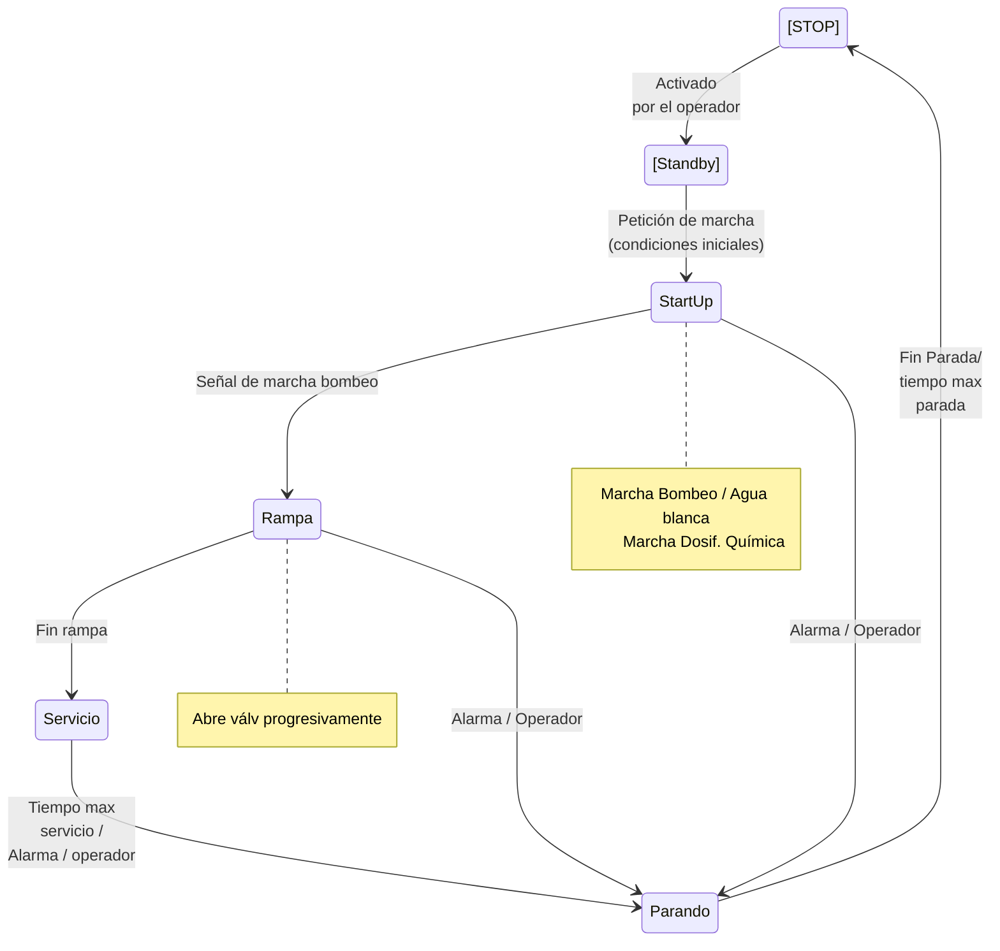

Antes de enviar agua al DAF tiene que arrancar: 

- Producir *agua blanca*, para las burbujas.
- Arrancar la dosificación química.

La presión en el *booster loop* es de 5 a 6 bar para disolver el aire en el agua.

Es el DAF el que "envía" la señal de marcha a las bombas para que se alimente el DAF.

El bombeo de fango del DAF arranca y para en base al nivel.

## Secuencia

1. Se dan condiciones para enviar agua al DAF (niveles "adecuados" en tanques previos y posteriores al DAF, están los equipos de químicos disponibles).
2. Se da orden de marcha al DAF.
3. Se arranca el bombeo y la producción de agua blanca.
4. Se arranca la dosificación química.
5. Se da permiso al bombeo al DAF.

### Transiciones

#### Condiciones de Paro

El sistema se detiene si se activa el bit la alarma DAF_ALARM que se define en la descripción funcional.

- Paro de emergencia
- Selección de operador
- Tiempo máximo de funcionamiento
- Alarma disparada por `BR7-PS0021A_AHH` o `BR7-PS0021A_ALL`
- Alarma disparada por `BR7-LS-007A`
- Alarma de alto nivel en el depósito de efluente BR7-LT-0014A_AH
- Alarma de alto nivel en el depósito de fangos BR7-LT-0015A_AH
- Alarma de bajo nivel disparada por `BR7-LS-0008A` (con retardo de 120 seg)
- No se tiene disponible la rasqueta
- No se tiene disponible ninguna bomba de recirculación (BR7-P-0214A/B)
- No se tiene disponible el bombeo de efluente. Eso incluye la bomba (BR7-P-0204A), válvulas (BR7-LV-0014A, BR7-UV-0330, BR7-UV-0329), depósitos de destino, etc.
- No se tiene disponible el bombeo de fangos. Esto incluye la bomba (BR7-P-0201A) y la disponibilidad del depósito BR7-T-0111.
- Disponibilidad de la dosificación de coagulante, si está seleccionada.
- Disponibilidad de la dosificación de poli, si está seleccionada.
- Alarma LL del caudal de entrada BR7-FT-0054A. 

<!-- A confirmar con Sam/Bélgica-->

- Alarma LL o HH del pH en el tanque de coagulación `BR7AT  0011A_58A_cntrl` (`BR7AT 0011A` / `BR7AT 0058A`). 

Condiciones Iniciales

<!-- No meter las dosificación de ácido y sosa como condición inicial -->

Condiciones de Marcha

Condiciones para la transición STOP --> Standby

Condiciones para la transición Standby -->Start Up

- Decisión del operador (botón "START")
- Condiciones de marcha ("DAF_DEM"). Este bit se activa por las condiciones de los equipos **externos** al DAF en la secuencia del conjunto de la planta y que quedan fuera del alcance de esta descripción, pero tendrán que tener en cuenta, al menos, lo siguiente:
  - Nivel de los tanques previos de donde se va a bombear el agua hacia el DAF
  - Temperatura del influente a enviar al DAF.

Condiciones para la transición Start Up --> Rampa

- Se han arrancado los equipos del DAF:
  - Bombeo de agua blanca (BR7-P-0214A/B)
  - Agitadores BR7-AG-0201A, BR7-AG-0202A
  - Rasqueta BR7-Z-0201A
  - Se ha iniciado la dosificación.
  - Se ha abierto la válvula BR7-FV-0006A hasta su posición inicial.
  - Se arranca el bombeo.
  - El caudal medido en BR7-FT-0006A supera determinado valor durante unos segundos.

Condiciones para la transición Rampa --> Servicio

Condiciones para la transición Servicio --> Parando

#### Condiciones para la transición Parando --> Stand-by

Se han de cumplir las siguientes condiciones

- Se ha terminado el tiempo de rasqueta (si la rasqueta está disponible).
- Se ha vaciado el depósito de fangos (`DAF_SLUDGE_Lact` < `DAF_SLUDGE_L_Parando`, si el bombeo de fangos está disponible).

#### Start up

En esta etapa se ponen en marcha los siguientes equipos:
- Bomba de agua blanca (BR7-P-214A/B)
- Agitadores BR7-AG-0201A, BR7-AG-0202A
- Rasqueta BR7-Z-0201A
- Bombeo de coagulante, si se ha seleccionado desde el SCADA.
- Bombeo de poli, si se ha seleccionado desde el SCADA.

Tras pasar un tiempo determinado `T_wait_ini_start_up` se permite la apertura de la válvula BR7-FV-0006A.

Ésta se abre hasta una posición inicial `FV-0006A_spos_ini_start_up` a establecer en las consignas en el SCADA. <!-- Normalmente esto se hace directamente en el bloque PID de PCS7 -->

Una vez se abre hasta la posición deseada, se da permiso al bombeo. 

Al iniciarse el bombeo se empieza a leer caudal en BR7-FT-0006A. Cuando el caudal supere el valor `FT-0006A_ini_start_up` durante un tiempo `T_FV-0006A_pos_ini_start_up` se inicia la siguiente etapa.

#### Rampa

Para el control del caudal al DAF existe un PID cuyo SP de caudal será `BR7-FC-0006A_SP` que normalmente opera en *automático*. 

Durante la fase de **Rampa** la consigna de PID va a aumentado desde el valor `FT-0006A_ini_start_up` al valor `BR7-FC-0006A_SP` durante el tiempo consignado `Tim_SP_FC-0006A`. 

Cuando se inicial la fase de rampa, dos contadores incrementales se ponen en marcha: 
- Un contador incremental `Tim_Cta_FC-0006A` desde 0 a `Tim_SP_FC-0006A`
- Un contador decremental `Tim_Cta_Int_FC-0006A` desde `Tim_Int_FC-0006A`a 0. 

Durante la fase de rampa se realiza el siguiente cálculo:

 `SP_Rampa_FC-0006A` = ((`BR7-FC-0006A_SP` - `FT-0006A_ini-start-up`)/ `Tim_SP-FC-0006A`) * `Tim_Cta_FC-0006A` + `FT-0006A_ini-start-up`

El contador `Tim_Cta_Int_FC-0006A` al llegar a 0 se resetea, y cada vez que llega a cero se actualiza en el bloque PID el valor del SP de caudal por `SP_Rampa_FC-0006A`

Una vez finaliza la cuenta `SP_Rampa_FC-0006A`, se pasa a la estapa de **Servicio**.

#### Parando

**PARÁMETROS**

| TAG | DESCRIPCIÓN | UNIDAD | VALOR INICIAL |
| --- | --------------- | --------- | ------ |
| `Tim_Rasqueta_parando` | Tiempo en marcha de la rasqueta durante la fase "**Parando**" | min. | 5 |
| `Tim_Espera_Bombeo_Efluente` | Tiempo de espera para arrancar el bombeo del efluente durante la fase "Parando" | min. | 3 |

Durante la fase de parando se mantiene la rasqueta durante un tiempo y se vacía la cámara de fango. 

Se establece un tiempo de rasqueta en marcha durante la fase "parando" (`Tim_Rasqueta_parando`). Al finalizar este tiempo la rasqueta se detiene.

Durante la fase "parando" se pone en marcha el bombeo cuando ha transcurrido el `Time_Espera_Bombeo_Efluente` o bien se ha alcanzado el nivel mínimo para el arranque durante la fase de parada (`DAF_SLUDGE_Lact` > `DAF_SLUDGE_H_Parando` durante unos segundos) y se espera a que el nivel llegue a su nivel más bajo (`DAF_SLUDGE_Lact` < `DAF_SLUDGE_L_Parando` durante unos segundos).

Si la rasqueta no está disponible, se salta el tiempo `Tim_Rasqueta_parando`.

## Notas a la instrumentación 

### Analógicas "raras"

FT-054. Caudal 

LT-15: Fango. Tiene asociada una alarma HH que para el bombeo de entrada al DAF y una señal de *release* para la marcha/paro de la bomba de fangos.

 

LT-14: Efluente (agua limpia). Tiene asociada una alarma HH que para el bombeo de entrada al DAF y una señal de *release* para la marcha/paro de la bomba de efluente.

Los pH-metros y los transmisores.

Hay 2 transmisores:

AT-0013A que coge la señal del pH-metro AE-0013A y que la envía junto a la señal de temperatura. Se mide en línea.

AT-0010A que coge la señal de los siguientes equipos:

- AE-0010A: sólidos en cámara de coagulación
- AE-0011A: pH en cámara de coagulación
- AE-0012A: sólidos en salida (cámara con el efluente limpio)
- AE-0058A: pH en cámara de coagulación (redundante con el 11)

Como dice la descripción, hay que ver si la redundancia AE11/AE58 se usa de forma que ambos tengan que dar la señal de marcha paro (o uno de los dos), o si se selecciona cuál es "el que manda".

### El cuadro neumático y sus instrumentos

Hay dos pt/ps:

**PT/PS-0021. ISE20C.** Está conectado al vessel o reactor. Tiene 5 hilos: positivo, negativo, salida transistor 1, salida transistor 2 y salida analógica.

Señales:

- PS0021AAH

- PS0021AAL

- PT0021A

**PT/PS-0550. ISE20B.** Está conectado a la entrada de aire comprimido. Tiene 4 hilos: positivo, negativo, salida digital transistor y salida analógica.

- PS0550A

- PT0550A

### Habilitación de alarmas analógicas y digitales

| **Tag** | **Descripción** | **Condiciones de habilitación** |
| ------ | ------------ | ---------------- |
| BR7-FT-0006A | Caudal de entrada al DAF 1A | Etapa Servicio |
| BR7-LT-0015A | Nivel en cámara de fango del DAF 1A | Siempre |
| BR7-LT-0014A | Nivel en cámara de agua tratada del DAF 1A | Siempre |
| BR7-LS-007A | Nivel en cámara de coagulación del DAF 1A | No está activo el final de carrera BR7ZSL  0301 ni la posición de la válvula de regulación BR7ZT   0006A es cero |
| BR7-LS-0008A | Nivel alto en el calderín BR7-V-0201A  | Alguna de las bombas BR7-P-0214A/B está en marcha |
| BR7-PS0021A_AHH | Señal DIGITAL de alta presión en el calderín BR7-V-0201A | Siempre |
| BR7-PS0021A_ALL | Señal DIGITAL de baja presión en el calderín BR7-V-0201A | Alguna de las bombas BR7-P-0214A/B está en marcha. La ALARMA tiene un retardo de 40 s |

## FUNCIONAMIENTO DE LA SECUENCIA DE AIRE EN EL VESSEL

### Operación de la válvula de entrada de aire al vessel UV-0327A:

Condiciones de apertura de la válvula UV-0327A (AND):

- Está en marcha el bombeo de *agua blanca* con alguna de las bombas P-0214A/B.

- No hay señal `BR7-PS0021A_AHH` ni `BR7-PS0021A_ALL`.

- Está activado el `PS0550A`. 

- El DAF está en arranque o servicio.

- No tiene alarma de parada de DAF.

- El nivel LS-0008A está alto (activado) durante 20 s.

  

Condiciones de cierre de la válvula UV-0327A (OR)

- No está en marcha el bombeo de *agua blanca* con alguna de las bombas P-0214A/B.

- Hay señal `BR7-PS0021A_AHH`.

- No está activado el PS-055A. 

- El DAF no está ni en arranque ni en servicio.

- El nivel LS-0008A está bajo (desactivado) durante 5 s.

- Tiene alarma de parada de DAF.

### Operación de la válvula de salida de aire del vessel UV-0328A

Condiciones de apertura de la válvula UV-0327A (AND):

- Hay señal `BR7-PS0021A_AHH` durante 3 seg.

- El DAF no está parado por el operador.

- El DAF está en la fase de "*parando*".

Condiciones de cierre de la válvula UV-0327A (OR):

- No hay señal `BR7-PS0021A_AHH` durante 3 seg.

- El DAF está parado por el operador.

## Válvulas de purga

Existen 4 válvulas de purga BR7-UV-0323A, BR7-UV-0324A, BR7-UV-0325A y BR7-UV-0326A; situadas debajo de los tolvines del DAF. El propósito de estas válvulas es extraer el fango decantado en el equipo. 

Variables asociadas:

Existen las siguientes consignas (a fijar por el operador):

- Tiempo de espera para abrir una válvula de purga. En minutos u horas. `UP201A_T_espera_valv_purga`
- Tiempo de apertura de válvula. En segundos o minutos. `UP201_T_apertura_valv_purga`
- Tiempo de espera entre apertura de válvulas. En segundos. `UP201_csgT_espera_purga`

Cada válvulas contará con las siguientes variables internas:

- Contador de tiempo de espera para abrir. En minutos u horas. `UV0323AT_espera`, `UV0324AT_espera`, `UV0325AT_espera` y `UV0326AT_espera`.
- Contador de tiempo de válvula abierta. En segundos. `UV0323AT_apertura`, `UV0324AT_apertura`, `UV0325AT_apertura` y `UV0326AT_apertura`.

Durante la fase de servicio cada contador de válvula irá incrementando el contador de tiempo de espera para abrir. Cuando el contador de este tiempo de espera sea superior a la consigna de tiempo de espera para abrir (`UV032xAT_espera` > `UP201A_T_espera_valv_purga`) se levanta un bit para pedir la apertura ( `UV0323Ab_apertura`, `UV0324Ab_apertura`, `UV0325Ab_apertura` y `UV0326Ab_apertura`) y se mete en una cola.

Si está activo el bit `UP201_bpermisoT_espera_purga`, se abre la válvula que esté la primera de la cola y se empieza a contar el tiempo de válvula abierta (`UV0323AT_apertura`, `UV0324AT_apertura`, `UV0325AT_apertura` y `UV0326AT_apertura`). Cuando dicho tiempo sea mayor o igual a la consigna `UP201_T_apertura_valv_purga`, la válvula se cierra y se saca de la cola.

Al finalizar el tiempo de apertura de válvula y está cerrada, se desactiva el bit `UP201_bpermisoT_espera_purga` y empieza a contar el tiempo `UP201_ctaT_espera_purga`. Cuando dicho tiempo sea mayor o igual que `UP201_csgT_espera_purga` se activa el bit `UP201_bpermisoT_espera_purga`. 

Si durante la apertura de la válvula se para la bomba BR7-P-0201A, se cierra la válvula y se queda en espera hasta que vuelva a arrancar y se congela la cuenta de tiempo de válvula abierta (no se desactiva el bit `UP201_bpermisoT_espera_purga` ni se modifica la cola).

Esta purga automática no está permitida durante las fases de STOP ni Standby.

## Bombeo de recirculación  (BR7-P-214A/B)

Como se ha dicho antes, el bombeo se arranca durante la etapa de start-up y permanece en marcha hasta la etapa de parando. La selección de la bomba que arranque puede ser según la selección del operador o para igualar los tiempos de funcionamiento. En caso de que sea la primera opción, tras un periodo de inactividad de una bomba (a consignar por el operador), se deberá dar un aviso para su arranque, al menos en manual, durante cierto tiempo de forma que se evite que un equipo que está a la intemperie esté parado durante mucho tiempo.

Si el equipo que está como principal entra en fallo, el equipo de reserva entra en servicio sin modificar la secuencia. 

En caso de que se active la señal `BR7-PS0021A_ALL` el equipo de reserva se pondrá en marcha. Se tendrá un selector en la pantalla para que en caso de que entre el equipo de reserva de apoyo, se pare el principal o siga en marcha.  

Si la señal `BR7-PS0021A_ALL` está activa durante un tiempo determinado (a consignar por el operador, normalmente 40 seg.), se activará la alarma de paro del DAF y detiene el sistema por completo.

## Bombeo de Efluente

## Bombeo de Fangos

Existirán las siguientes variables para controlar el bombeo de fangos:

| TAG                  | Descripción                                             |
| -------------------- | ------------------------------------------------------- |
| DAF_SLUDGE_vSP       | Velocidad de la bomba                                   |
| DAF_SLUDGE_vMax      | Velocidad máxima                                        |
| DAF_SLUDGE_vMin      | Velocidad mínima                                        |
| DAF_SLUDGE_Lact      | Nivel actual del depósito                               |
| DAF_SLUDGE_LMax      | Nivel correspondiente a la velocidad máxima de la bomba |
| DAF_SLUDGE_LMin      | Nivel correspondiente a la velocidad mínima de la bomba |
| DAF_SLUDGE_H_Serv    | Nivel de arranque del bombeo en fase de servicio        |
| DAF_SLUDGE_L_Serv    | Nivel de paro del bombeo en fase de servicio            |
| DAF_SLUDGE_H_Parando | Nivel de arranque del bombeo en fase de parando         |
| DAF_SLUDGE_L_Parando | Nivel de paro del bombeo en fase de parando             |
| DAF_SLUDGE_LL        | Nivel de protección del bombeo de fangos                |

Como se indica en la descripción de control, la velocidad de la bomba es proporcional al caudal. 

Existen dos niveles de arranque y paro, un par durante la fase de "servicio" y otro durante la fase de "parando", que serán sensiblemente inferiores a éstos, ya que lo que se quiere conseguir es que se vacíe el depósito tras el paro.

### Enclavamientos

- No hay alarma de nivel HH (o como se determine, por parte de Worley) en los niveles BR7-LT-0016/17 del tanque de fangos del DAF1, BR7-T-0111.
- No hay alarma de nivel muy bajo (`DAF_SLUDGE_Lact` < `DAF_SLUDGE_LL`).
- 

## Dosificación de sosa y ácido

### Redundancia de valores de pH

En la cámara de coagulación del DAF se han colocado dos sondas de pH, BR7-AE-0058A y BR7-AE-0011A, que van al mismo transmisor, pero cada una tiene una salida analógica (se consideran 2 entradas analógicas, `BR7AT  0011A` y `BR7AT  0058A`, aunque en el Hardware Freeze esté como "*BR7AT  0058*"). 

Se crearán dos variables, la media de ambos valores de pH `BR7AT  0011A_58A_mean` y el valor absoluto de la diferencia `BR7AT  0011A-58A_abs`.

Normalmente se utilizará el valor medio `BR7AT  0011A_58A_mean` para ajustar el pH y determinar si hay que arrancar alguna dosificación (control del pH). 

Se establecerá un control para que en caso de una discrepancia alta o por selección del operador, cuál de los valores `BR7AT  0011A` o `BR7AT  0058A`se usa para el control del pH. 

En caso de hilo roto de alguno de los valores, o que se vaya a inicio o fondo de escala, se usará el otro valor (si no tiene hilo roto ni se ha ido a fondo o inicio de escala), para el control del pH.

Para esta descripción, se denominará `BR7AT  0011A_58A_cntrl` al valor usado para el control del pH.

Se establecerán 3 puntos de consigna para el valor absoluto de la diferencia (discrepancia): H, HH y L:
- si `BR7AT  0011A-58A_abs BR7AT` >  `0011A-58A_abs_H` dará una alarma (warning);
- si `BR7AT  0011A-58A_abs BR7AT` >  `0011A-58A_abs_H` dará una alarma que hará que el valor para el control del pH sea el de la sonda predeterminada por el operador. 

### Control del pH

Se establecen 6 puntos de consigna, 2 para arrancar/parar el ácido y 2 para arrancar/parar la sosa y otros 2 para la regulación.

| TAG                            | Descripción                                       |
| ------------------------------ | ------------------------------------------------- |
| BR7AT  0011A_58A_cntrl_H_acido | Consigna de arranque de la dosificación de ácido. |
| BR7AT  0011A_58A_cntrl_acido   | SetPoint para el PID del ácido                    |
| BR7AT  0011A_58A_cntrl_L_acido | Consigna de paro de la dosificación de ácido.     |
| BR7AT  0011A_58A_cntrl_H_sosa  | Consigna de paro de la dosificación de sosa.      |
| BR7AT  0011A_58A_cntrl_sosa    | SetPoint para el PID de la sosa                   |
| BR7AT  0011A_58A_cntrl_L_sosa  | Consigna de arranque de la dosificación de sosa.  |

 

- Si `BR7AT  0011A_58A_cntrl` > `BR7AT  0011A_58A_cntrl_H_acido` se arranca la dosificación de ácido. 9
- Si `BR7AT  0011A_58A_cntrl` < `BR7AT  0011A_58A_cntrl_L_acido` se detiene la dosificación de ácido. 7,5
- Si `BR7AT  0011A_58A_cntrl` < `BR7AT  0011A_58A_cntrl_L_sosa` se arranca la dosificación de sosa. 6
- Si `BR7AT  0011A_58A_cntrl` > `BR7AT  0011A_58A_cntrl_H_sosa` se detiene la dosificación de sosa. 6,5

Se espera que `BR7AT  0011A_58A_cntrl_H_acido` > `BR7AT  0011A_58A_cntrl_L_acido` >  `BR7AT  0011A_58A_cntrl_H_sosa` > `BR7AT  0011A_58A_cntrl_L_sosa`

Habrá dos SP para la regulación de las dosificadoras, una para el ácido y otra para la sosa, que quedarán en algún punto intermedio entre las consignas de marcha y paro de cada dosificación.

El sistema vigilará que los ajuste de marcha/paro por pH de las dosificadoras sean consistentes, es decir, que no se pueda poner en marcha a la vez las dos dosificaciones. 

## Rasqueta (BR7-Z-0201A)

### Condiciones de arranque

En funcionamiento en cada una de las siguientes etapas:

- Start-up
- Rampa
- Servicio
- Parando, mientras no se cumpla el tiempo de rasqueta en esta fase (`Tim_Rasqueta_parando`).

### Condiciones de paro

Si no está en ninguna de estas etapas, o si está en la etapa de "Parando" y se ha cumplido el tiempo (`Tim_Rasqueta_parando`).

