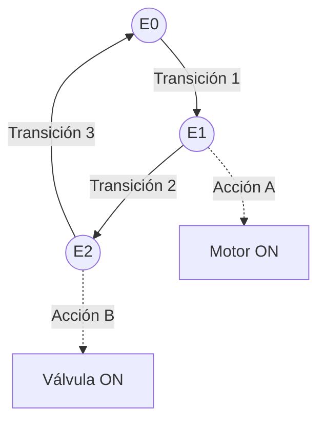
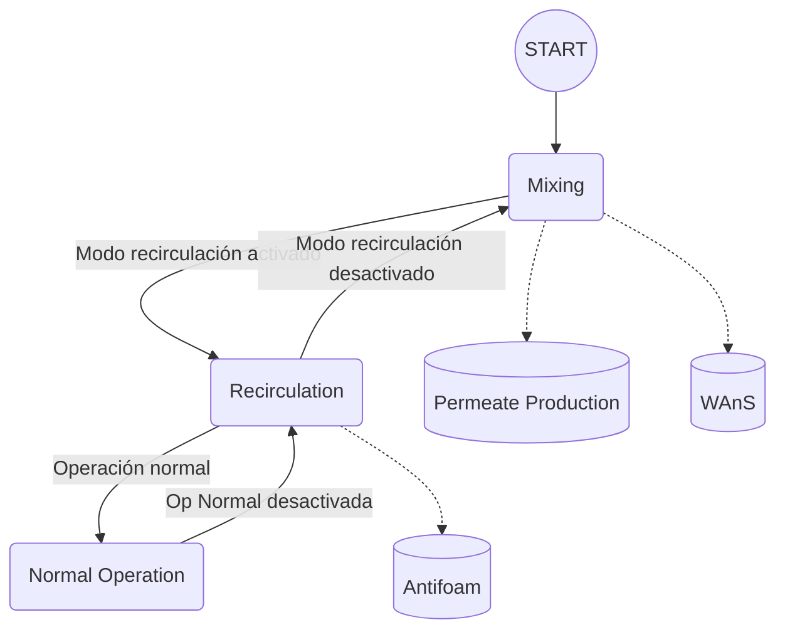
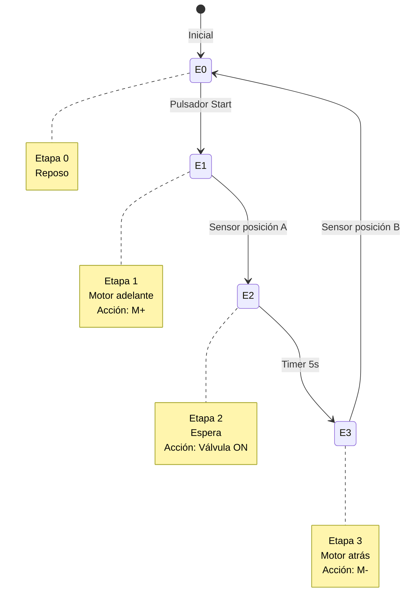
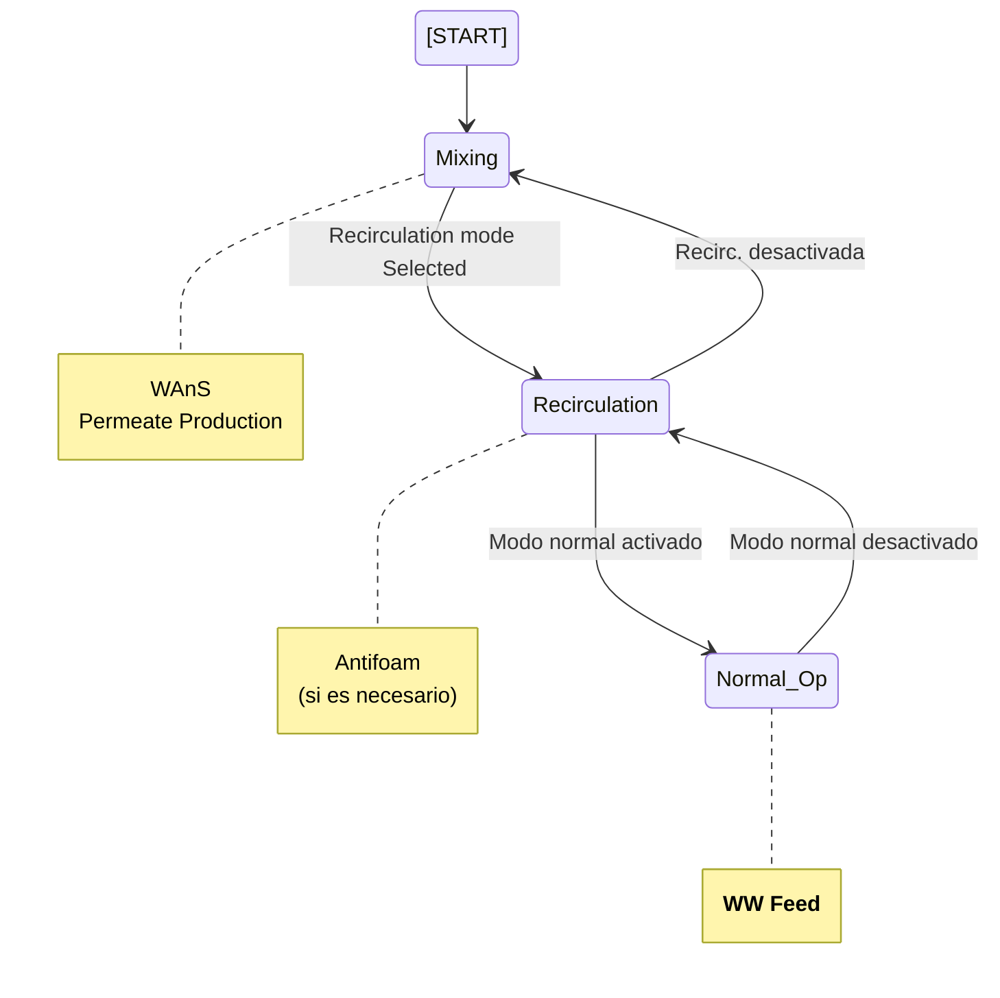
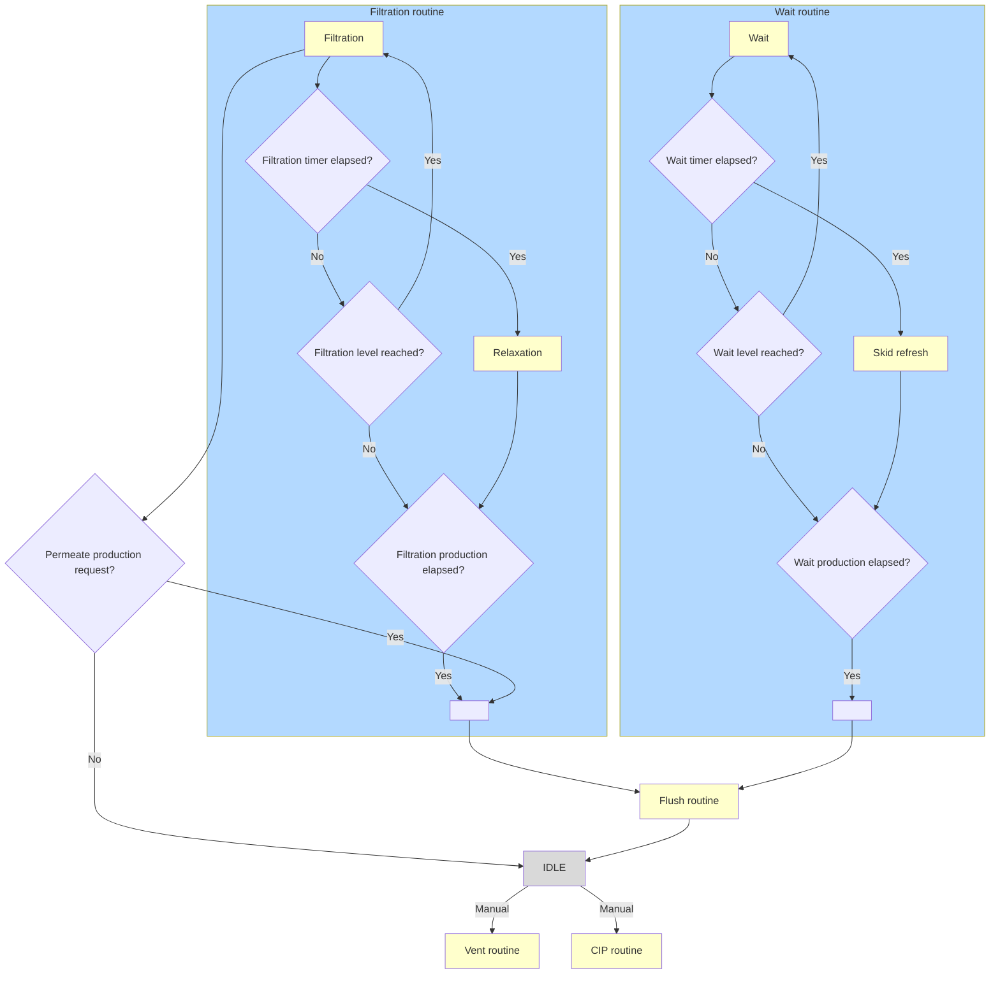
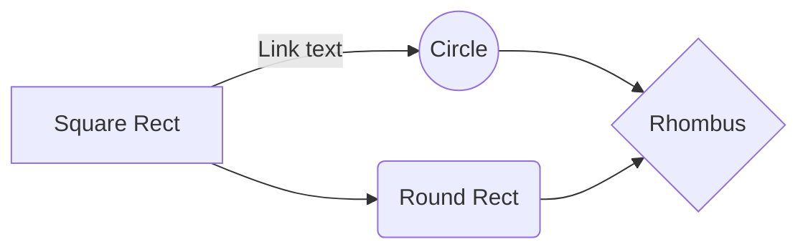
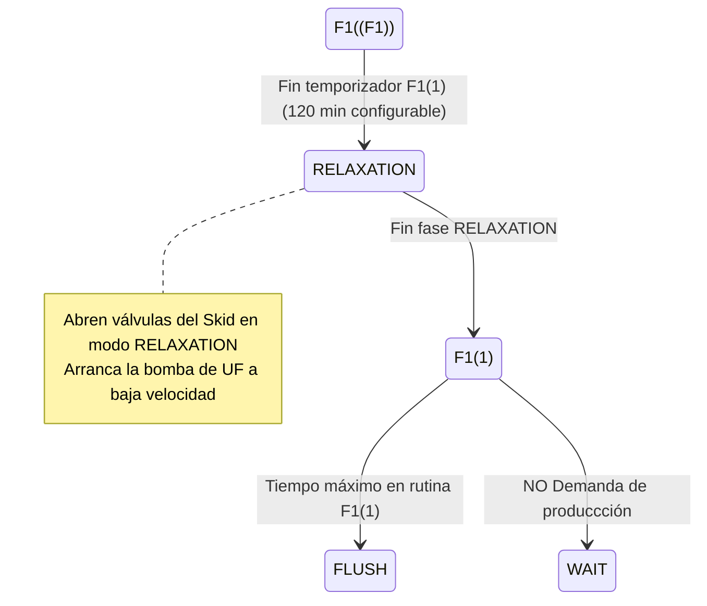
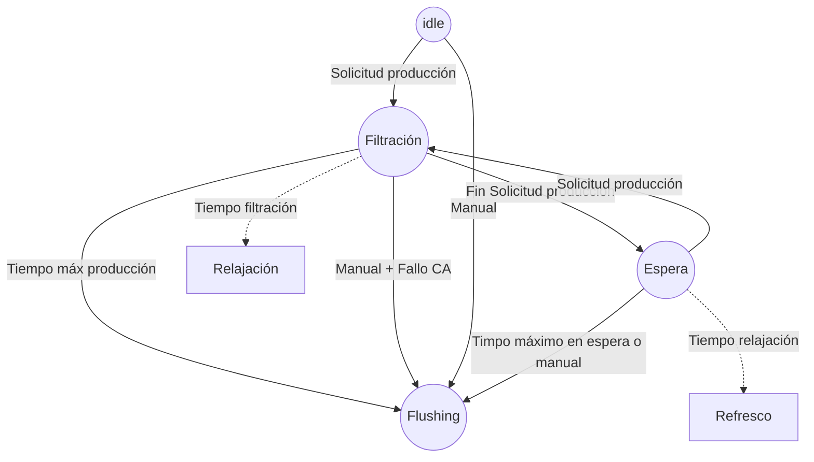

```mermaid
graph TD
    E0((E0)) -->|Transición 1| E1((E1))
    E1 -->|Transición 2| E2((E2))
    E2 -->|Transición 3| E0
    E1 -.->|Acción A| A[Motor ON]
    E2 -.->|Acción B| B[Válvula ON]
```

Probar lo que hay en la esp. func.

```mermaid
graph TD
    E0((START)) --> E1(Mixing)
    E1 -->|Modo recirculación activado| E2(Recirculation)
    E2 -->|Modo recirculación desactivado| E1
    E2 -->|Operación normal| E3(Normal Operation)
    E3 -->|Op Normal desactivada| E2
    E1 -.-> B[(Permeate Production)]
    E2 -.-> C[(Antifoam)]
    E1 -.-> A[(WAnS)]
  
```

```mermaid
stateDiagram-v2
    [*] --> E0: Inicial
    E0 --> E1: Pulsador Start
    note right of E0
        Etapa 0
        Reposo
    end note
    
    E1 --> E2: Sensor posición A
    note right of E1
        Etapa 1
        Motor adelante
        Acción: M+
    end note
    
    E2 --> E3: Timer 5s
    note right of E2
        Etapa 2
        Espera
        Acción: Válvula ON
    end note
    
    E3 --> E0: Sensor posición B
    note right of E3
        Etapa 3
        Motor atrás
        Acción: M-
    end note
```

```mermaid
stateDiagram-v2
    [START] --> Mixing
    Mixing --> Recirculation: Recirculation mode Selected
    note right of Mixing
        WAnS
        Permeate Production
    end note
    
    Recirculation --> Normal_Op: Modo normal activado
    note right of Recirculation
        Antifoam 
        (si es necesario)
    end note
    
    Normal_Op --> Recirculation: Modo normal desactivado
    note right of Normal_Op
        **WW Feed**
    end note
    
    Recirculation --> Mixing: Recirc. desactivada
```

```mermaid
flowchart TD
    subgraph FR["Filtration routine"]
        F1[Filtration] --> F2{Filtration timer elapsed?}
        F2 -->|No| F3{Filtration level reached?}
        F2 -->|Yes| R1[Relaxation]
        F3 -->|No| F4{Filtration production elapsed?}
        F3 -->|Yes| F1
        R1 --> F4
        F4 -->|Yes| FR_OUT[ ]
    end
    
    subgraph WR["Wait routine"]
        W1[Wait] --> W2{Wait timer elapsed?}
        W2 -->|No| W3{Wait level reached?}
        W2 -->|Yes| SR1[Skid refresh]
        W3 -->|No| W4{Wait production elapsed?}
        W3 -->|Yes| W1
        SR1 --> W4
        W4 -->|Yes| WR_OUT[ ]
    end
    
    F1 --> F5{Permeate production request?}
    F5 -->|Yes| FR_OUT
    F5 -->|No| IDLE
    
    FR_OUT --> FLUSH[Flush routine]
    WR_OUT --> FLUSH
    
    FLUSH --> IDLE[IDLE]
    
    IDLE --> |Manual| VENT[Vent routine]
    IDLE --> |Manual| CIP[CIP routine]
    
style FR fill:#b3d9ff
style WR fill:#b3d9ff
style IDLE fill:#d9d9d9
style F1 fill:#ffffcc
style W1 fill:#ffffcc
style R1 fill:#ffffcc
style SR1 fill:#ffffcc
style FLUSH fill:#ffffcc
style VENT fill:#ffffcc
style CIP fill:#ffffcc
    
```

```mermaid
graph LR
  A[Square Rect] -- Link text --> B((Circle))
  A --> C(Round Rect)
  B --> D{Rhombus}
  C --> D

```

```mermaid
stateDiagram-v2
    F1((F1)) --> RELAXATION: Fin temporizador F1(1) (120 min configurable)
    
    F1(1) --> FLUSH: Tiempo máximo en rutina F1(1)
    
    RELAXATION --> F1(1): Fin fase RELAXATION
    note right of RELAXATION
        Abren válvulas del Skid en modo RELAXATION
        Arranca la bomba de UF a baja velocidad 
    end note
    
   F1(1) --> WAIT: NO Demanda de produccción
```

## APS

```mermaid
graph TD
    E0((idle)) -->|Solicitud producción| E1((Filtración))
    E1 -->|Fin Solicitud producción| E2((Espera))
    E1((Filtración)) -->|Tiempo máx producción| E3((Flushing))
    E1((Filtración)) -->|Manual + Fallo CA| E3((Flushing))
    E0 -->|Manual| E3
    E2 -->|Timpo máximo en espera o manual| E3
    E2 -->|Solicitud producción| E1
    E1 -.->|Tiempo filtración| A[Relajación]
    E2 -.->|Tiempo relajación| B[Refresco]
```

```mermaid
graph TD
    E0((E0)) -->|Transición 1| E1((E1))
    E1 -->|Transición 2| E2((E2))
    E2 -->|Transición 3| E0
    E1 -.->|Acción A| A[Motor ON]
    E2 -.->|Acción B| B[Válvula ON]
```
